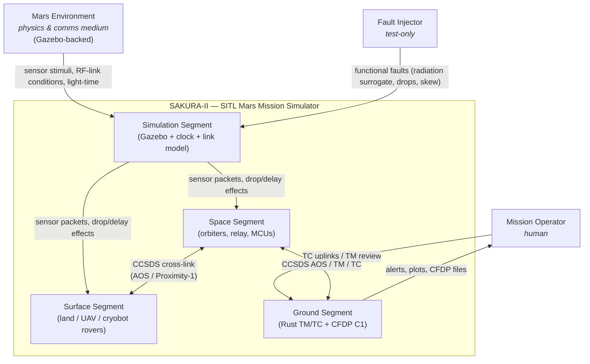
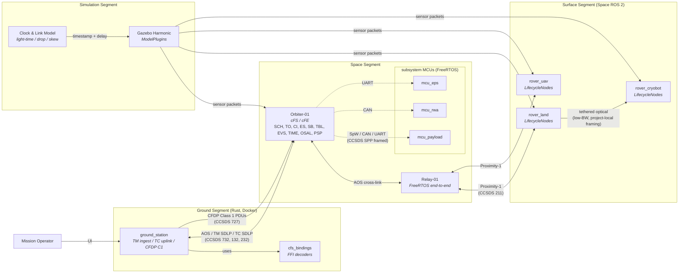

# 00 — System of Systems

> Terminology: [../GLOSSARY.md](../GLOSSARY.md). Coding conventions: [.claude/rules/](../../.claude/rules/). Mission context: [../mission/conops/ConOps.md](../mission/conops/ConOps.md).

This is the top-level architectural view of SAKURA-II. It fixes **what boxes exist** and **what boundaries they speak across**. Box internals are in the segment docs (`01`–`06`); boundary contracts are in [`../interfaces/`](../interfaces/); cross-cutting concerns (comms, timing, failure, scaling) are in `07`–`10`.

Diagrams follow the [C4 model](https://c4model.com/): Level 1 (System Context), Level 2 (Container).

## 1. Level 1 — System Context

Who interacts with SAKURA-II from outside, and what does the system-under-development do?

Boundaries crossed by this diagram:

- `Ground ↔ Space`: documented in [`../interfaces/ICD-orbiter-ground.md`](../interfaces/ICD-orbiter-ground.md) (planned).
- `Space ↔ Surface`: [`../interfaces/ICD-relay-surface.md`](../interfaces/ICD-relay-surface.md) (planned) + [`../interfaces/ICD-orbiter-relay.md`](../interfaces/ICD-orbiter-relay.md) (planned).
- `Sim ↔ FSW`: [`../interfaces/ICD-sim-fsw.md`](../interfaces/ICD-sim-fsw.md) (planned) — the sideband by which Gazebo injects sensor readings and link-effect flags into FSW without polluting flight-path code.

## 2. Level 2 — Containers

"Container" in C4 = an independently deployable / runnable process. This view names every container SAKURA-II deploys and shows their protocol-level relationships.

### Container inventory

| Container | Runtime | Source dir | Detail doc |
|---|---|---|---|
| `ground_station` | Rust binary, containerized | `rust/ground_station/` | `06-ground-segment-rust.md` (planned) |
| `cfs_bindings` | Rust library (linked by `ground_station`) | `rust/cfs_bindings/` | `06-ground-segment-rust.md` (planned) |
| Orbiter-01 | cFS on Linux (dev) / HPSC target (future), containerized | `apps/orbiter_*` (planned; `sample_app` is the template) | [`01-orbiter-cfs.md`](01-orbiter-cfs.md) (planned) |
| Relay-01 | FreeRTOS in QEMU, containerized | `apps/freertos_relay/` (planned) | [`02-smallsat-relay.md`](02-smallsat-relay.md) (planned) |
| `mcu_payload`, `mcu_rwa`, `mcu_eps` | FreeRTOS in QEMU, one container each | `apps/mcu_*/` (planned) | [`03-subsystem-mcus.md`](03-subsystem-mcus.md) (planned) |
| `rover_land` | Space ROS 2, containerized with Gazebo bridge | `ros2_ws/src/rover_land/` (planned; `rover_bringup` + `rover_teleop` are the template) | [`04-rovers-spaceros.md`](04-rovers-spaceros.md) (planned) |
| `rover_uav` | Space ROS 2, containerized | `ros2_ws/src/rover_uav/` (planned) | `04-rovers-spaceros.md` (planned) |
| `rover_cryobot` | Space ROS 2, containerized | `ros2_ws/src/rover_cryobot/` (planned) | `04-rovers-spaceros.md` (planned) |
| `gazebo` | Gazebo Harmonic, containerized | `simulation/gazebo_rover_plugin/` + others | [`05-simulation-gazebo.md`](05-simulation-gazebo.md) (planned) |
| `clock_link_model` | Shim injecting light-time and link effects | `simulation/` (new module, planned) | [`08-timing-and-clocks.md`](08-timing-and-clocks.md) + [`09-failure-and-radiation.md`](09-failure-and-radiation.md) |

### PlantUML-C4 source

The rendered L2 diagram above uses Mermaid for in-Markdown rendering on GitHub. A higher-fidelity C4 rendering is kept as PlantUML in [`diagrams/l2-containers.puml`](diagrams/l2-containers.puml) (planned, Phase B); it uses `C4-PlantUML` stereotypes (`System`, `Container`, `ContainerDb`, `Rel_D`, etc.) and renders alongside as `diagrams/l2-containers.svg`. Both sources are committed; the SVG is authoritative for external review.

## 3. Protocol Layering Across Boundaries

Every boundary above carries a CCSDS-family protocol stack. Full detail is in [`07-comms-stack.md`](07-comms-stack.md) (planned); the short version:

| Boundary | L2 (link / frame) | L3 (network / transfer) | L4 / App |
|---|---|---|---|
| Ground ↔ Orbiter | AOS Transfer Frame (CCSDS 732.0-B) + TM SDLP (132.0-B) / TC SDLP (232.0-B) | Space Packet Protocol (CCSDS 133.0-B-2) | HK telemetry, commands, CFDP Class 1 PDUs (CCSDS 727.0-B) |
| Orbiter ↔ Relay | AOS (cross-link profile) | SPP | Relay-forward packets |
| Relay ↔ Surface | Proximity-1 (CCSDS 211.0-B) | SPP | HK, commands |
| Rover ↔ Cryobot (tether) | Project-local optical framing (low-BW, see `ICD-cryobot-tether.md` — planned) | SPP (reduced secondary header) | HK summary, drill commands |
| Orbiter ↔ MCU | SpW / CAN / UART (simulated) | SPP-in-frame | Subsystem TM/TC |
| Gazebo ↔ FSW | In-process or shared-memory sideband | Custom typed sensor packets | Sensor readings, link effects |

## 4. Deployment Topology (Docker)

Each container in §2 is a docker-compose service. Compose profiles parameterize fleet size:

| Profile | Spacecraft count | Surface assets | Use |
|---|---|---|---|
| `minimal` | 1 orbiter, 1 relay | 1 land, 1 UAV, 1 cryobot | Default, fits on a laptop |
| `full` | MVC as above | MVC as above | Full demo |
| `scale-5` | 5 orbiters, 1 relay | 5 land, 3 UAV, 2 cryobot | Scalability / routing stress |

The `docker-compose.yml` plus profile YAMLs and `.env.example` are prerequisites out of scope of this doc set; tracked separately. [`../dev/docker-runbook.md`](../dev/docker-runbook.md) (planned) documents profile use once they exist.

## 5. Why this decomposition

Three load-bearing decisions justify the shape above; anything calling for a different decomposition should cite and refute one of these.

1. **Segments partition by "who owns the code," not "who owns the physics."** Orbiter and relay both orbit Mars but have different FSW stacks (cFS vs FreeRTOS), different safety postures, and different module boundaries; forcing them into a single "Space Segment" at the container level would hide the protocol-adapter work that the relay actually does. Keeping them distinct containers with a named cross-link boundary makes that adapter visible.
2. **Subsystem MCUs are containers, not library-level code inside Orbiter.** They run a different RTOS, they can fault independently, and their CCSDS framing over SpW/CAN/UART is a real boundary — not a function call. Treating them as containers forces us to write `ICD-mcu-cfs.md` and prevents a class of "oh, we just called into the payload driver directly" short-circuits.
3. **Simulation is a segment, not a test harness.** Radiation, light-time, and sensor noise are **first-class effects** per the project brief. Keeping Gazebo + the clock/link model as a named segment prevents FSW code from accidentally coupling to simulation internals — all coupling happens through the sim↔FSW ICD, which is the same pattern flight hardware would expose through its bus.

## 6. What this diagram is NOT

- Not a deployment diagram at the OS level (process tree, threading). That lives in each segment doc.
- Not a timing / scheduling view. That lives in [`08-timing-and-clocks.md`](08-timing-and-clocks.md) (planned).
- Not a failure-propagation view. That lives in [`09-failure-and-radiation.md`](09-failure-and-radiation.md) — including how faults cross the boundaries shown here.
