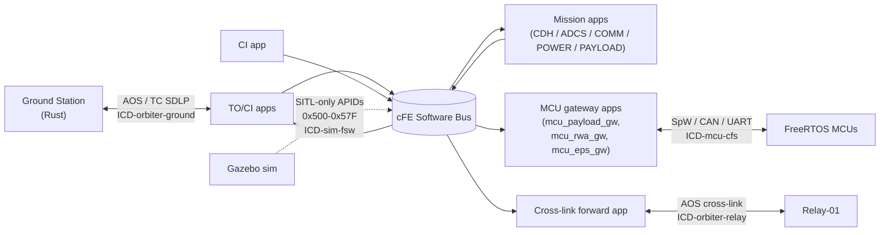
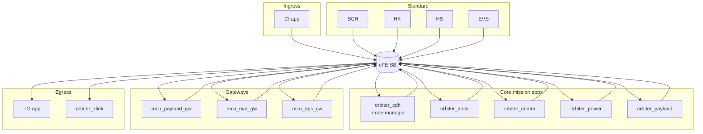

# 01 — Orbiter (cFS Primary FSW)

> Terminology: [../GLOSSARY.md](../GLOSSARY.md). Coding conventions: [.claude/rules/cfs-apps.md](../../.claude/rules/cfs-apps.md), [.claude/rules/general.md](../../.claude/rules/general.md), [.claude/rules/security.md](../../.claude/rules/security.md). System context: [00-system-of-systems.md](00-system-of-systems.md). Protocol stack: [07-comms-stack.md](07-comms-stack.md). Time: [08-timing-and-clocks.md](08-timing-and-clocks.md). Scaling: [10-scaling-and-config.md](10-scaling-and-config.md). APID registry: [../interfaces/apid-registry.md](../interfaces/apid-registry.md). Packet bodies: [../interfaces/packet-catalog.md](../interfaces/packet-catalog.md). Decisions: [../standards/decisions-log.md](../standards/decisions-log.md).

This doc fixes the **internal structure of the orbiter flight software**: the cFE service set, the mission-app inventory, the gateway apps that bridge the orbiter to the MCUs, and the cFS-side responsibilities at each external boundary. The orbiter is the SAKURA-II "box" that runs NASA cFS — CFE + OSAL + PSP plus a MISRA-C:2012 application set — and mediates between ground, relay, subsystem MCUs, and (in SITL builds) the simulation sideband.

Segment scope is limited to the orbiter-class asset (`Orbiter-01..05` per [10 §3](10-scaling-and-config.md)). Relay is [02-smallsat-relay.md](02-smallsat-relay.md); MCUs are [03-subsystem-mcus.md](03-subsystem-mcus.md). Boundaries (what packets cross where) live in the ICDs under [`../interfaces/`](../interfaces/); this doc describes the apps on the cFS side of each boundary.

## 1. Segment Context



The orbiter's cFS process is the **only SAKURA-II container that speaks all four external boundaries** (ground, relay, MCUs, sim sideband). Every boundary goes through the cFE Software Bus (SB) — there are no ad-hoc threads writing directly to NICs or bus drivers. Apps publish/subscribe by MID; the MID derives from APID per [ICD-mcu-cfs.md §3.1](../interfaces/ICD-mcu-cfs.md).

## 2. cFE Service Set (adopted)

| Service | Role | Source |
|---|---|---|
| CFE_ES | App lifecycle, startup table, restart types | cFE core |
| CFE_EVS | Event filtering + routing; **sole runtime-message channel** per [.claude/rules/general.md](../../.claude/rules/general.md) | cFE core |
| CFE_SB | Software Bus: all inter-app messaging | cFE core |
| CFE_TBL | Table services for configurable parameters | cFE core |
| CFE_TIME | Time services; sources CUC from the time authority ladder per [08 §3](08-timing-and-clocks.md) | cFE core |
| OSAL | OS abstraction; targets POSIX in SITL, VxWorks-compatible on HPSC (per [10 §4](10-scaling-and-config.md)) | OSAL |
| PSP | Platform support; SITL PSP today, HPSC PSP deferred per [Q-H8](../standards/decisions-log.md) | PSP |

Direct `OS_printf` or C `printf` on the orbiter is **prohibited** in flight-path code — every runtime message is an event via `CFE_EVS_SendEvent`. See [.claude/rules/general.md](../../.claude/rules/general.md) and [.claude/rules/cfs-apps.md](../../.claude/rules/cfs-apps.md).

## 3. Mission App Inventory

### 3.1 Standard cFS apps (reused, not authored here)

| App | Purpose | Owns APIDs (TM) |
|---|---|---|
| CI (Command Ingest) | Receives TC SDLP from ground, publishes on SB | — (consumer) |
| TO (Telemetry Output) | Subscribes to downlink-class MIDs on SB, emits AOS to ground | — (producer) |
| SCH (Scheduler) | Wall-clock-driven dispatch of periodic table entries | — |
| HK (Housekeeping) | Periodic HK packet aggregation | `0x100`–`0x10F` (HK tier) |
| HS (Health & Safety) | Watchdog, CPU hog detect, safe-mode arbitration | `0x110` |

All of these are stock cFS apps. Their presence and configuration is fixed by mission need; per-mission configuration (stack sizes, pipe depths) flows through [`../../_defs/mission_config.h`](../../_defs/mission_config.h) and `_defs/mission.yaml` per [10 §6](10-scaling-and-config.md).

### 3.2 Mission-authored apps

The mission writes one app per orbiter subsystem. Each app subclasses the cFS app pattern (see `sample_app` for the reference shape) and owns a disjoint APID slice from [../interfaces/apid-registry.md](../interfaces/apid-registry.md):

| App | APIDs (TM) | Role | Directory |
|---|---|---|---|
| `orbiter_cdh` | `0x120`–`0x12F` | Command-and-data handling: TC dispatch, mode manager | `apps/orbiter_cdh/` (planned) |
| `orbiter_adcs` | `0x130`–`0x13F` | Attitude determination & control (sensor fusion + RWA commanding) | `apps/orbiter_adcs/` (planned) |
| `orbiter_comm` | `0x140`–`0x14F` | Radio manager, link-state reporter, CFDP receiver on the FSW side | `apps/orbiter_comm/` (planned) |
| `orbiter_power` | `0x150`–`0x15F` | Power domain manager, EPS arbiter, load shedding | `apps/orbiter_power/` (planned) |
| `orbiter_payload` | `0x160`–`0x16F` | Payload instrument control, timeline execution | `apps/orbiter_payload/` (planned) |
| `sample_app` | `0x170` | Reference/template app; stays in-tree as a living example | [`apps/sample_app/`](../../apps/sample_app/) |

This table is **not** asserting all apps exist today. As of this doc's authoring, only `sample_app` is in-tree ([`apps/sample_app/`](../../apps/sample_app/)); the rest are planned and tracked in `_defs/targets.cmake` via `MISSION_APPS` when authored. Adding a new app is a three-step change — directory + CMakeLists, MID entries in [apid-registry.md](../interfaces/apid-registry.md), and an `MISSION_APPS` line in [`../../_defs/targets.cmake`](../../_defs/targets.cmake).

### 3.3 Gateway apps (cFS side of MCU buses)

Per [ICD-mcu-cfs.md §1](../interfaces/ICD-mcu-cfs.md), each MCU class has a dedicated gateway app:

| App | Bus | MCU class APIDs | Directory |
|---|---|---|---|
| `mcu_payload_gw` | SpaceWire (ECSS-E-ST-50-12C) | `0x280`–`0x28F` | `apps/mcu_payload_gw/` (planned) |
| `mcu_rwa_gw` | CAN 2.0A | `0x290`–`0x29F` | `apps/mcu_rwa_gw/` (planned) |
| `mcu_eps_gw` | UART/HDLC | `0x2A0`–`0x2AF` | `apps/mcu_eps_gw/` (planned) |

Gateway apps are flight-side; MCU firmware is [03-subsystem-mcus.md](03-subsystem-mcus.md). The contract at the cFS SB is uniform: gateway apps publish inbound MCU TM verbatim to the SB under `MID = 0x0800 | APID`, and subscribe to `MID = 0x1800 | APID` for outbound TC. They implement bus-level reassembly (especially CAN) but never alter SPP payload bytes.

### 3.4 Cross-link forwarding app

`orbiter_xlink` (planned) forwards surface-asset TM/TC between the cross-link to the relay ([ICD-orbiter-relay.md](../interfaces/ICD-orbiter-relay.md) §2) and the ground downlink. It:

- Rewrites the relay's SCID (43) to the orbiter SCID (42) before ground emission per [ICD-orbiter-relay.md §2.3](../interfaces/ICD-orbiter-relay.md).
- Preserves APID and instance-ID unchanged — per-class, not per-instance, per [docs/README.md](../README.md) Contributing Conventions.
- Does not decode CFDP PDUs; those pass through at the SPP layer.

## 4. Internal App Topology



There is no app-to-app direct call; everything goes through the SB. This is the whole point of cFS — it's what lets the mission test individual apps in isolation (`ctest`) without rebuilding the runtime.

## 5. Source Tree Layout (per-app)

Following the `sample_app` shape, every mission app and gateway app uses the same directory skeleton:

```
apps/<app_name>/
├── CMakeLists.txt
└── fsw/
    ├── src/
    │   ├── <app_name>.c         — AppMain + command dispatch
    │   ├── <app_name>.h
    │   ├── <app_name>_events.h  — event IDs (one entry minimum per [CLAUDE.md](../../CLAUDE.md))
    │   └── <app_name>_version.h
    └── unit-test/
        └── <app_name>_test.c    — CMocka; target 100 % branch coverage per [.claude/rules/testing.md](../../.claude/rules/testing.md)
```

Canonical reference in-tree: [`apps/sample_app/fsw/src/sample_app.c`](../../apps/sample_app/fsw/src/sample_app.c), [`apps/sample_app/fsw/src/sample_app_events.h`](../../apps/sample_app/fsw/src/sample_app_events.h), [`apps/sample_app/fsw/unit-test/sample_app_test.c`](../../apps/sample_app/fsw/unit-test/sample_app_test.c).

## 6. Memory & Stack Discipline

- **No dynamic allocation** anywhere under `apps/` — `malloc`/`calloc`/`realloc`/`free` are banned per [.claude/rules/general.md](../../.claude/rules/general.md). All buffers are statically sized.
- **Task stack depth** defaults to `SAKURA_II_TASK_STACK = 8192` bytes from [`../../_defs/mission_config.h`](../../_defs/mission_config.h). Apps that require more declare their own constant in their `_app.h` and justify it in-file.
- **Pipe depths** cap at `SAKURA_II_MAX_PIPES = 8` per app; higher depth requires a config header override and a rationale.
- **VLAs forbidden** per MISRA Rule 18.8 ([.claude/rules/security.md](../../.claude/rules/security.md)).
- `.critical_mem` section anchor is reserved for EDAC-protected state per [Q-F3](../standards/decisions-log.md) (definition site: [09-failure-and-radiation.md §5.1](09-failure-and-radiation.md)).

## 7. Command & Event Conventions

### 7.1 Command dispatch

Per [.claude/rules/cfs-apps.md](../../.claude/rules/cfs-apps.md): every app exposes a single command-dispatch `switch` on the secondary-header function code, with a `default:` case that emits an "invalid command" event and returns a MISRA-legal error. Dispatch is synchronous — long-running work (e.g. ADCS sensor fusion) runs in the app's own periodic task, not in the dispatch callback.

### 7.2 Event IDs

Every app registers at least one event type in its `<app>_events.h`. Event ID namespace is `0xAABBCCCC` where `AA` = app class nibble, `BB` = instance-family nibble, `CCCC` = per-event integer. Reference: [`apps/sample_app/fsw/src/sample_app_events.h`](../../apps/sample_app/fsw/src/sample_app_events.h).

### 7.3 HK packet shape

Every app produces exactly one HK packet per its assigned APID. Packet bodies follow [../interfaces/packet-catalog.md](../interfaces/packet-catalog.md). HK is triggered by a `SCH` entry, not by the app's own timer — this keeps HK cadence globally deterministic and auditable from one file ([10 §6](10-scaling-and-config.md)).

## 8. Boundary Responsibilities (orbiter side)

| Boundary | Orbiter-side owner | ICD |
|---|---|---|
| Ground ↔ Orbiter (AOS + TC SDLP) | `CI` (up) + `TO` (down) | [ICD-orbiter-ground.md](../interfaces/ICD-orbiter-ground.md) |
| Orbiter ↔ Relay (cross-link) | `orbiter_xlink` (planned) | [ICD-orbiter-relay.md](../interfaces/ICD-orbiter-relay.md) |
| Orbiter ↔ MCU (SpW / CAN / UART) | `mcu_payload_gw`, `mcu_rwa_gw`, `mcu_eps_gw` (planned) | [ICD-mcu-cfs.md](../interfaces/ICD-mcu-cfs.md) |
| Sim → FSW (SITL only) | `orbiter_comm` (sim-sideband subscribe) | [ICD-sim-fsw.md](../interfaces/ICD-sim-fsw.md) |

The sim-sideband is `0x500`–`0x57F` per [07 §9](07-comms-stack.md); these APIDs are **flight-mode-gated off** in non-SITL builds via a compile-time flag (design pending — tracked in [10-scaling-and-config.md](10-scaling-and-config.md)). On the ground side, the same APIDs are rejected on RF per [06-ground-segment-rust.md §8.2](06-ground-segment-rust.md).

## 9. Time Authority (orbiter role)

Per [08 §3](08-timing-and-clocks.md) and [Q-F4](../standards/decisions-log.md), the orbiter is **primary-during-LOS** time authority: when ground is out of sight, the orbiter's own SCLK is truth, and downstream (relay → rover → cryobot) slave to it. `CFE_TIME` is the clock source; on-boot time is seeded from the last ground-sync snapshot, then disciplined by the ground time-sync packet when AOS is re-acquired. Drift budget during LOS: **50 ms over 4 hours (3.47 ppm)** per [Q-F4](../standards/decisions-log.md).

The time-suspect flag (bit 0 of TM secondary-header `func_code`) is set by `CFE_TIME` when the local clock's free-running estimate exceeds a mission-configurable threshold (currently 1 ms per [08 §4](08-timing-and-clocks.md)). Apps do not set the flag themselves.

## 10. Configuration Surfaces

Per [Q-H2](../standards/decisions-log.md): the orbiter's four config surfaces are fixed.

| Surface | What it controls | Change cadence |
|---|---|---|
| [`../../_defs/mission_config.h`](../../_defs/mission_config.h) | Compile-time C constants (SCID, pipe depths, stack sizes) | Rebuild |
| [`../../_defs/targets.cmake`](../../_defs/targets.cmake) | `MISSION_NAME`, `MISSION_APPS` list | Rebuild |
| `_defs/mission.yaml` (planned per [10 §6](10-scaling-and-config.md)) | Runtime-overridable: OWLT, HK cadence, table names | Process restart |
| cFS startup tables | Per-app launch order, default priorities | Process restart |

The orbiter **does not** read configuration from any other source. Environment variables, command-line args, and runtime file reads are not config surfaces for FSW — if it can affect flight behavior, it's either compile-time or via a cFE TBL.

## 11. Fault & Degraded-Mode Behavior

| Fault | Detector | Orbiter response |
|---|---|---|
| Ground LOS (no valid uplink > 10 s) | `orbiter_comm` link-state | Switch to autonomous-SCLK time source ([08 §3](08-timing-and-clocks.md)); continue HK production |
| Cross-link LOS (relay unreachable) | `orbiter_xlink` timeout | Buffer surface-forward TM up to bounded buffer (size in `mission.yaml`); on overflow, drop oldest + emit event |
| Gateway bus fault (e.g. CAN CRC error storm) | Gateway app counters | Reject faulted frames ([ICD-mcu-cfs.md §2.2](../interfaces/ICD-mcu-cfs.md)); emit rate-limited event |
| App watchdog miss | `HS` app | Per `HS` config: restart app (default) or transition orbiter to safe mode |
| TC checksum fail | `CI` | Drop TC; emit event; do not publish to SB |
| Sim-block APID on RF (build gate bypassed) | `TO` egress filter | **Reject at source** — cFS must not emit `0x500`–`0x57F` on ground downlink regardless of subscriber. This mirrors the ground-side guard in [06 §8.2](06-ground-segment-rust.md). |

Fault-injection APIDs (`0x540`–`0x543`) enter the orbiter via the sim sideband only ([Q-F2](../standards/decisions-log.md)). The orbiter consumes them (for test scenarios) but MUST NOT re-emit them on any external boundary.

## 12. Traceability

| Normative claim | Section | Upstream source |
|---|---|---|
| cFS + MISRA C:2012 + no dynamic allocation in FSW | §2, §6 | [CLAUDE.md](../../CLAUDE.md), [.claude/rules/general.md](../../.claude/rules/general.md) |
| One gateway app per MCU bus (SpW / CAN / UART) | §3.3 | [ICD-mcu-cfs.md](../interfaces/ICD-mcu-cfs.md) |
| SCID = 42 (Orbiter-01) | §2, §3 | [`_defs/mission_config.h`](../../_defs/mission_config.h), [apid-registry.md](../interfaces/apid-registry.md) |
| Per-class APID allocation; per-instance via secondary-header `instance_id` | §3.2, §3.3 | [ICD-mcu-cfs.md §3.1](../interfaces/ICD-mcu-cfs.md), [10 §6](10-scaling-and-config.md) |
| Orbiter time authority during LOS; 50 ms / 4 h drift | §9 | [Q-F4](../standards/decisions-log.md), [08 §3–4](08-timing-and-clocks.md) |
| Sim-block APIDs MUST NOT egress on ground RF | §11 | [Q-F2](../standards/decisions-log.md), [06 §8.2](06-ground-segment-rust.md) |
| All runtime messages via `CFE_EVS_SendEvent` | §2, §7 | [.claude/rules/general.md](../../.claude/rules/general.md) |

## 13. Decisions Referenced / Open Items

Referenced (resolved elsewhere):

- [Q-C5](../standards/decisions-log.md) Proximity-1 hailing cadence — consumed at orbiter-relay cross-link boundary.
- [Q-C7](../standards/decisions-log.md) Star topology — orbiter is the "hub" from surface's perspective; definition site is [02-smallsat-relay.md](02-smallsat-relay.md).
- [Q-F4](../standards/decisions-log.md) Time authority ladder — orbiter is node 2 in the ladder.
- [Q-H1](../standards/decisions-log.md) HPSC execution model — SMP Linux with cFS under `SCHED_FIFO` pthreads.
- [Q-H2](../standards/decisions-log.md) Four config surfaces — enumerated in §10.

Open, tracked for follow-up:

- Actual mission-app directory creation (CDH/ADCS/COMM/POWER/PAYLOAD) — lands as code PRs when the mission starts implementing beyond the `sample_app` reference.
- HPSC cross-build target (`_defs/targets.cmake` host profile) — deferred per [Q-H8](../standards/decisions-log.md).
- Safe-mode transition table (conditions, actions, recovery) — summary is in §11; per [09 §4](09-failure-and-radiation.md) the detailed safing-path state machine is a segment-level artifact that expands here when the orbiter mission apps are authored.
- Sim-block egress filter implementation — compile-time flag design pending in [10-scaling-and-config.md](10-scaling-and-config.md).

## 14. What this doc is NOT

- Not a cFS tutorial. See the cFS upstream docs for how apps are structured in general.
- Not an ICD. Per-boundary packet bodies, framing, and timing live in [`../interfaces/`](../interfaces/).
- Not a coding rulebook. Rules are in [.claude/rules/](../../.claude/rules/); this doc cites them.
- Not an app-by-app SDD. Per-app design detail belongs in `apps/<app>/README.md` or an app-level doc when the app is authored.
- Not the MCU firmware story. That's [03-subsystem-mcus.md](03-subsystem-mcus.md).
