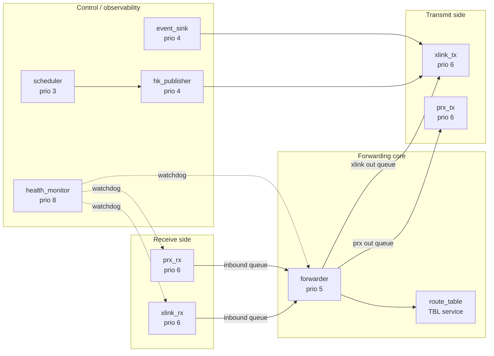

# 02 — Smallsat Relay (FreeRTOS End-to-End)

> Terminology: [../GLOSSARY.md](../GLOSSARY.md). Coding conventions: [.claude/rules/general.md](../../.claude/rules/general.md), [.claude/rules/security.md](../../.claude/rules/security.md). System context: [00-system-of-systems.md](00-system-of-systems.md). Protocol stack: [07-comms-stack.md](07-comms-stack.md). Time: [08-timing-and-clocks.md](08-timing-and-clocks.md). Scaling: [10-scaling-and-config.md](10-scaling-and-config.md). APID registry: [../interfaces/apid-registry.md](../interfaces/apid-registry.md). Orbiter-side boundary: [../interfaces/ICD-orbiter-relay.md](../interfaces/ICD-orbiter-relay.md). Surface-side boundary: [../interfaces/ICD-relay-surface.md](../interfaces/ICD-relay-surface.md). Decisions: [../standards/decisions-log.md](../standards/decisions-log.md).

This doc is the **definition site for [Q-C7](../standards/decisions-log.md)** (Scale-5 inter-orbiter topology = star, relay-mediated). It fixes the internal structure of the smallsat relay — a single FreeRTOS-based spacecraft bridging orbiters to surface assets. No cFS: the relay is a smallsat-class platform with no room for the cFE runtime, so FSW is a single FreeRTOS image with task-per-responsibility topology.

Segment scope: Relay-01 (SCID 43). Per-instance scaling of relay count is deferred — [10 §2](10-scaling-and-config.md) commits to exactly one relay in all profiles. A future multi-relay topology is an additive profile extension; the interface contracts in [ICD-orbiter-relay.md](../interfaces/ICD-orbiter-relay.md) and [ICD-relay-surface.md](../interfaces/ICD-relay-surface.md) already support it.

## 1. Topology (Q-C7 Definition Site)

Per [Q-C7](../standards/decisions-log.md): **"Star topology (relay-mediated). Direct inter-orbiter mesh is out of scope for Phase B. Simplifies routing tables; Phase B+ seam for mesh preserved in relay forwarding code."**

```
  Ground                 ┌──── Orbiter-01 (primary during LOS)
    │                    │
    │  AOS / TC SDLP     ├──── Orbiter-02 ──┐
    ▼                    │     ...          │
  ┌──────────┐  AOS      │                  │ cross-link
  │ Orbiter  │◀─────────▶│     Orbiter-05 ──┘ (one session active)
  └──────────┘  cross-link      │
                                ▼
                          ┌──────────┐
                          │ Relay-01 │ (this doc — FreeRTOS end-to-end)
                          └──────────┘
                                │ Proximity-1 (bi-directional)
                                ▼
                   ┌──────────────────────────┐
                   │ rover_land-*, rover_uav-*,│
                   │ rover_cryobot-*           │
                   └──────────────────────────┘
```

Load-bearing consequences of the star decision:

1. **Surface assets only talk to one upstream peer.** Relay is the sole authority in their Proximity-1 contract ([ICD-relay-surface.md §1](../interfaces/ICD-relay-surface.md)). No direct orbiter ↔ surface session exists.
2. **Only one orbiter ↔ relay session is active at a time** per [ICD-orbiter-relay.md §1](../interfaces/ICD-orbiter-relay.md). The active orbiter is the one with `time_authority: primary-during-los` in `_defs/mission.yaml` ([10 §3](10-scaling-and-config.md)). Other orbiters are cross-link-passive until a relay-managed handoff.
3. **Relay owns the Proximity-1 state machine** — surface-asset state machines are slaves ([ICD-relay-surface.md §2](../interfaces/ICD-relay-surface.md)).
4. **Mesh seam preserved.** Forwarding logic (§5) is already keyed on `(source_scid, dest_scid)` pairs, so a future mesh extension is additive — no routing-table refactor when Phase B+ adds inter-orbiter links.

Single-point-of-failure posture: yes, the relay is SPOF in Scale-5. Mitigation is a deferred multi-relay profile (out of scope per [10 §2](10-scaling-and-config.md)).

## 2. Why FreeRTOS (not cFS)

The relay is a smallsat-class platform — think 12U cubesat envelope — with limits that make the full cFE runtime impractical:

- **RAM budget**: ~128 MB is typical; cFE + OSAL + PSP overhead plus a meaningful app set runs closer to cFS-orbiter territory.
- **Single-purpose**: the relay has exactly one job (bridge). No TBL services, no EVS routing complexity, no app-level fault containment beyond what FreeRTOS already provides.
- **Deterministic scheduling**: FreeRTOS priority scheduling is a better fit for the relay's tight dataflow (rx → forward → tx) than cFS's SB-mediated many-to-many app graph.

The cost is that we lose cFS's standard conveniences (CFE_EVS, CFE_TBL, CFE_SB). We pay that cost explicitly by reimplementing a **minimum slice** — enough to preserve the operator's experience (telemetry, events, table updates) but not the full cFS API. See §4.

## 3. Task Topology

The relay firmware is a single FreeRTOS image with the task set below. Priorities are mission-configurable in `_defs/mission.yaml`; defaults listed here.



### 3.1 Task inventory

| Task | Priority | Period / trigger | Responsibility |
|---|---|---|---|
| `xlink_rx` | 6 | Interrupt-driven | Decode AOS frames from the cross-link driver; extract SPPs; enqueue to forwarder |
| `prx_rx` | 6 | Interrupt-driven | Decode Proximity-1 frames from the surface-link driver; extract SPPs; enqueue to forwarder |
| `forwarder` | 5 | Queue-driven | Single-writer route decision + queue-selection for egress; no blocking |
| `xlink_tx` | 6 | Queue-driven | AOS framing; serialize bytes to cross-link driver |
| `prx_tx` | 6 | Queue-driven | Proximity-1 framing; serialize to surface-link driver |
| `scheduler` | 3 | 1 Hz, 10 Hz | Periodic triggers for HK, health, hailing |
| `hk_publisher` | 4 | 1 Hz via `scheduler` | Build relay HK packet (`PKT-TM-0200-0002`), enqueue to `xlink_tx` |
| `event_sink` | 4 | Queue-driven | Batch event reports; enqueue as event-TM packets |
| `health_monitor` | 8 (highest) | 1 Hz | Monitor task watchdog counters; trigger safe-mode on fault |

### 3.2 Queue topology

All inter-task handoffs use **FreeRTOS queues with bounded depth**. No dynamic allocation after boot.

| Queue | Producers | Consumer | Depth | Overflow policy |
|---|---|---|---|---|
| `q_inbound_xlink` | `xlink_rx` | `forwarder` | 64 SPPs | Drop-newest + event |
| `q_inbound_prx` | `prx_rx` | `forwarder` | 64 SPPs | Drop-newest + event |
| `q_outbound_xlink` | `forwarder`, `hk_publisher`, `event_sink` | `xlink_tx` | 128 SPPs | Drop-oldest + event |
| `q_outbound_prx` | `forwarder` | `prx_tx` | 64 SPPs | Drop-newest + event |
| `q_events` | any task | `event_sink` | 32 entries | Drop-newest silently (log counter only) |

Overflow counters are exposed in `PKT-TM-0200-0002` HK per [ICD-orbiter-relay.md §2 / packet-catalog](../interfaces/ICD-orbiter-relay.md); operators see queue pressure in the ground UI within one HK tick.

### 3.3 Priority inversion protection

FreeRTOS priority inheritance on mutexes is **on** (`configUSE_MUTEXES = 1`, `configUSE_RECURSIVE_MUTEXES = 0`). The forwarder is the only task that holds a mutex (route table access in §5.2); all other task interactions use queues, which do not require mutexes.

## 4. cFS-Equivalence Minimum Slice

The relay reimplements enough of cFS's observability conveniences to keep the operator experience uniform with the orbiter.

| cFS facility | Relay equivalent | Notes |
|---|---|---|
| `CFE_EVS_SendEvent` | `relay_event(event_id, severity, fmt, ...)` helper | Same event-ID namespace convention as cFS; emitted as `PKT-TM-0201-0002` (event TM APID) |
| `CFE_SB_Subscribe` / `Publish` | Direct queue handoff | No message-bus abstraction — at relay scale the added indirection has no value |
| `CFE_TBL` | Route table + HK-cadence table in static flash region, updated via `PKT-TC-0240-0001` | No TBL-file format; tables are CCSDS SPP TC commands |
| `CFE_TIME` | `relay_time.c` using a monotonic FreeRTOS tick + sync-packet input ([08 §5](08-timing-and-clocks.md)) | Relay is node 3 in the time-authority ladder ([Q-F4](../standards/decisions-log.md)) |
| Watchdog | `health_monitor` task + hardware watchdog (on real HW; SITL emulates via FreeRTOS tick hook) | — |
| Startup | `main()` → `FreeRTOS_CreateStaticTask` × N → `vTaskStartScheduler()` | No CFE_ES_Startup sequence |

Direct `printf` is **banned** on the relay identically to cFS orbiter per [.claude/rules/general.md](../../.claude/rules/general.md) — `relay_event()` is the only runtime-message path.

## 5. Forwarding Rules

### 5.1 Route decision

The `forwarder` task's job is to decide, for each inbound SPP, which egress queue it belongs on. The decision is a pure function of `(inbound_leg, dest_scid, apid_block)`:

| Inbound leg | Dest SCID | APID block | Action |
|---|---|---|---|
| Cross-link | Orbiter SCID (42) | any | Discard — the relay is never the destination of an orbiter-bound TM |
| Cross-link | Surface SCID | `0x300`–`0x45F` (surface TC) | Enqueue to `q_outbound_prx` |
| Cross-link | Relay SCID (43) | `0x240`–`0x27F` (relay TC) | Route to local command handler |
| Proximity-1 | Orbiter SCID (42) | `0x300`–`0x45F` (surface TM) | Enqueue to `q_outbound_xlink` (forward to orbiter) |
| Proximity-1 | Orbiter SCID (42) | CFDP PDU | Enqueue to `q_outbound_xlink` — CFDP passes through at SPP layer; relay does not parse PDUs |
| Proximity-1 | Relay SCID (43) | `0x200`–`0x23F` (relay TM) | Local-origin HK; should not happen inbound — discard + event |
| Proximity-1 | Surface SCID | any | Discard — surface-to-surface via relay is not supported in Phase B |
| any | `0x540`–`0x543` | — | **Reject with `REJECT-FORBIDDEN-APID` event** — fault-inject APIDs are sim-only per [Q-F2](../standards/decisions-log.md); the relay MUST NOT forward them |
| any | `0x500`–`0x57F` (remainder) | — | Reject — sim block, never on RF |

Route rejection is always logged as a single event per (source, dest_scid, apid) triple and rate-limited to 1 Hz to avoid event floods during a sustained fault.

### 5.2 Route table (updateable)

The route table is a statically-allocated array of (dest_scid, dest_leg) tuples, updated by `PKT-TC-0240-0002` (route-table update) command from ground. Writes are guarded by the single relay mutex (priority-inheritance enabled per §3.3). Reads in `forwarder` are lock-free against the active table; atomic pointer swap on update.

Format detail is deferred to `PKT-TC-0240-0002` in [packet-catalog.md](../interfaces/packet-catalog.md) (planned).

### 5.3 Forwarding latency budget

Per [ICD-orbiter-relay.md §2.5](../interfaces/ICD-orbiter-relay.md): cross-link total budget ≈ 35 ms. The relay's contribution:

| Stage | Budget |
|---|---|
| `xlink_rx` (AOS deframe + FECF) | 5 ms |
| Queue handoff to `forwarder` | 1 ms |
| Route decision + queue-to-egress | 1 ms |
| Queue handoff to `xlink_tx` / `prx_tx` | 1 ms |
| Egress framing | 5 ms |
| **Relay internal total** | **< 15 ms** |

Surface-forward path has a similar budget; the Proximity-1 framing is lighter than AOS so the surface side is < 12 ms.

## 6. Surface Session Management

Per [ICD-relay-surface.md §2](../interfaces/ICD-relay-surface.md), the relay is the Proximity-1 **authority**. It runs the session state machine for every surface asset:

- Hails at **1 Hz** per [Q-C5](../standards/decisions-log.md) during acquisition.
- Grants at most one active session per asset.
- Tears down sessions after **30 s of data-LOS** per [Q-C5](../standards/decisions-log.md).
- Maintains a per-asset session context containing: asset class, instance ID, last-seen time, session state, pending-TC queue depth.

Session state transitions emit events (`PRX-SESSION-ESTABLISHED`, `PRX-SESSION-LOST`, etc.); the ground UI renders the per-asset session table from the relay HK packet.

Multi-asset contention: if two assets of the same class respond simultaneously to a hail, the relay grants the one with the lower instance ID and emits a `PRX-CONTENTION` event for the other. This is a rare (bench-test) scenario; in nominal operations the acquisition sequence is staggered by the `clock_link_model` asset-start offsets.

## 7. Source Tree Layout

The relay firmware lives under `apps/freertos_relay/` per [REPO_MAP.md §Top-Level Layout](../REPO_MAP.md). The directory does **not** exist today — it lands as a code PR alongside the first relay V&V scenario. Planned skeleton:

```
apps/freertos_relay/
├── CMakeLists.txt
├── src/
│   ├── main.c                 — task creation, vTaskStartScheduler
│   ├── tasks/
│   │   ├── xlink_rx.c
│   │   ├── prx_rx.c
│   │   ├── forwarder.c
│   │   ├── xlink_tx.c
│   │   ├── prx_tx.c
│   │   ├── scheduler.c
│   │   ├── hk_publisher.c
│   │   ├── event_sink.c
│   │   └── health_monitor.c
│   ├── routing/
│   │   └── route_table.c
│   ├── time/
│   │   └── relay_time.c
│   └── drivers/
│       ├── xlink_driver.c     — cross-link PHY shim (SITL = socket; HW = TBD)
│       └── prx_driver.c       — Proximity-1 PHY shim
├── include/
│   └── relay/
│       ├── events.h           — event ID namespace
│       └── mids.h             — APID / MID definitions mirroring apid-registry.md
└── unit-test/
    └── relay_test.c           — CMocka, targeting per [.claude/rules/testing.md](../../.claude/rules/testing.md)
```

The `freertos_*` prefix under `apps/` is the agreed naming convention per [REPO_MAP.md](../REPO_MAP.md) to distinguish non-cFS FSW from cFS apps — keeps static-analysis scoping (no-malloc, MISRA) uniform while letting build-graph rules route to the correct toolchain.

No dynamic allocation after boot. Static task and queue allocation using `xTaskCreateStatic` and `xQueueCreateStatic`.

## 8. Configuration

Per [Q-H2](../standards/decisions-log.md) four-surface rule, the relay's configuration lives in:

| Surface | What it controls |
|---|---|
| [`../../_defs/mission_config.h`](../../_defs/mission_config.h) (+ future `_defs/relay_config.h`) | Compile-time constants: relay SCID (43), task stack sizes, queue depths |
| `_defs/mission.yaml` (planned per [10 §3](10-scaling-and-config.md)) | Task priorities, HK cadence, hailing cadence override, surface asset roster |
| Route table (runtime) | Updated via `PKT-TC-0240-0002` command |
| Docker compose profile | Exactly one relay container across all profiles per [10 §2](10-scaling-and-config.md) |

## 9. Fault & Degraded-Mode Behavior

| Fault | Detector | Relay response |
|---|---|---|
| Cross-link LOS | `xlink_rx` no-frame timer | Continue buffering surface TM in `q_outbound_xlink`; on overflow, drop-oldest with event. Emit `XLINK-LOS` event. |
| Proximity-1 session LOS (per asset) | Session state machine 30 s timer | Tear down session, transition asset to `LISTENING`, emit `PRX-SESSION-LOST` with asset id per [ICD-relay-surface.md §2](../interfaces/ICD-relay-surface.md) |
| Task watchdog miss | `health_monitor` 1 Hz poll | Log + raise `RELAY-TASK-STALLED` event; restart task if recoverable; enter safe mode if `forwarder` dies |
| Route-table corruption (CRC fail on boot) | `route_table` init | Fall back to a static default route table (orbiter ↔ surface direct forwarding only); emit `ROUTE-TABLE-CORRUPT` event |
| Queue overflow | Queue helper | Drop per table in §3.2; increment counter; rate-limit event to 1 Hz |
| Forbidden-APID forward attempt | `forwarder` | Drop + event per §5.1 |

Safe mode on the relay: `forwarder` halts new TC egress and emits `RELAY-SAFE-MODE`. Incoming TM is still routed to ground so operators can diagnose. Exit requires a `PKT-TC-0240-0001` emergency-recovery TC (Type-BD on VC 7 per [ICD-orbiter-relay.md](../interfaces/ICD-orbiter-relay.md)).

## 10. Traceability

| Normative claim | Section | Upstream source |
|---|---|---|
| Star topology; no inter-orbiter mesh in Phase B | §1 | **[Q-C7](../standards/decisions-log.md) — this doc is definition site** |
| One orbiter ↔ relay session active at a time | §1 | [ICD-orbiter-relay.md §1](../interfaces/ICD-orbiter-relay.md) |
| 1 Hz hailing during acquisition, 30 s LOS timeout | §6 | [Q-C5](../standards/decisions-log.md) |
| Cryobot tether bitrate forms the bandwidth floor for surface routing | §5 | [Q-C1](../standards/decisions-log.md), [07 §6](07-comms-stack.md) |
| BE on wire; no conversion loci on the relay | §4, §5 | [Q-C8](../standards/decisions-log.md) |
| FreeRTOS static allocation; no dynamic alloc after boot | §3, §7 | [.claude/rules/general.md](../../.claude/rules/general.md) |
| Fault-inject APIDs (`0x540`–`0x543`) MUST NOT be forwarded | §5.1 | [Q-F2](../standards/decisions-log.md) |
| Single relay across all compose profiles | §1, §8 | [Q-C7](../standards/decisions-log.md), [10 §2](10-scaling-and-config.md) |

## 11. Decisions Resolved / Open Items

Resolved at this definition site:

- **[Q-C7](../standards/decisions-log.md) Scale-5 inter-orbiter topology** — **resolved**: star (relay-mediated) as specified in §1. Forwarding code's `(source_scid, dest_scid)` keying preserves the mesh seam for Phase B+.

Referenced (resolved elsewhere, carried here by cross-reference):

- [Q-C1](../standards/decisions-log.md) Tether bitrate — sets the floor for the surface-forward bandwidth the relay must accommodate.
- [Q-C5](../standards/decisions-log.md) Proximity-1 hailing cadence / LOS timeout — definition site is [ICD-orbiter-relay.md §3](../interfaces/ICD-orbiter-relay.md); consumed in §6.
- [Q-C8](../standards/decisions-log.md) BE on wire — no Rust conversion loci on the relay (C code); SPP bytes pass through verbatim.
- [Q-F2](../standards/decisions-log.md) Fault-inject APIDs — §5.1 rejection rule.
- [Q-F4](../standards/decisions-log.md) Time authority ladder — relay is node 3.

Open, tracked for follow-up:

- Multi-relay profile (topology, handoff protocol, SPOF mitigation) — deferred; not a Phase B goal.
- Actual FreeRTOS PSP / BSP selection for HW target — deferred per [Q-H8](../standards/decisions-log.md).
- Cross-link PHY driver — SITL uses a Unix-domain socket shim; real-HW driver is out of scope for Phase B.
- `PKT-TC-0240-0002` route-table update packet body — authored in a future [packet-catalog.md](../interfaces/packet-catalog.md) revision when the relay is implemented.

## 12. What this doc is NOT

- Not a FreeRTOS tutorial.
- Not an ICD. Packet bodies, framing, and timing at the relay's two boundaries live in [ICD-orbiter-relay.md](../interfaces/ICD-orbiter-relay.md) and [ICD-relay-surface.md](../interfaces/ICD-relay-surface.md).
- Not a hardware document. PHY drivers, power budget, thermal limits — all deferred until a real-HW target is on the schedule.
- Not a coding rulebook. Rules are in [.claude/rules/](../../.claude/rules/).
- Not an implementation tutorial. Runnable code lives under `apps/freertos_relay/` once authored; this doc governs that code's shape.
