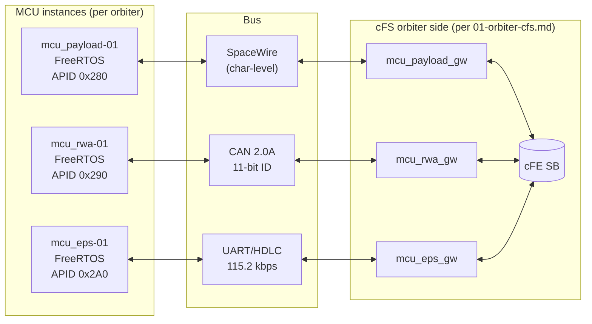
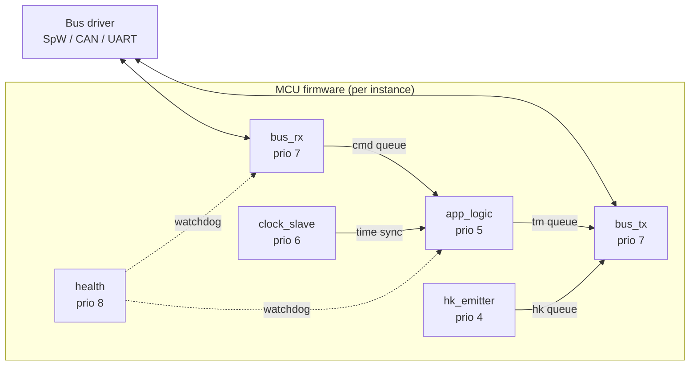

# 03 — Subsystem MCUs (FreeRTOS)

> Terminology: [../GLOSSARY.md](../GLOSSARY.md). Coding conventions: [.claude/rules/general.md](../../.claude/rules/general.md), [.claude/rules/security.md](../../.claude/rules/security.md). System context: [00-system-of-systems.md](00-system-of-systems.md). Protocol stack: [07-comms-stack.md](07-comms-stack.md). Time: [08-timing-and-clocks.md](08-timing-and-clocks.md). Scaling: [10-scaling-and-config.md](10-scaling-and-config.md). APID registry: [../interfaces/apid-registry.md](../interfaces/apid-registry.md). Packet bodies: [../interfaces/packet-catalog.md](../interfaces/packet-catalog.md). MCU ↔ cFS boundary: [../interfaces/ICD-mcu-cfs.md](../interfaces/ICD-mcu-cfs.md). Orbiter side: [01-orbiter-cfs.md](01-orbiter-cfs.md). Decisions: [../standards/decisions-log.md](../standards/decisions-log.md).

This doc is the **definition site for [Q-H4](../standards/decisions-log.md)** (MCU bus chip families — the class of bus per MCU role). It fixes the internal structure of the three subsystem-MCU classes (`mcu_payload`, `mcu_rwa`, `mcu_eps`), their FreeRTOS firmware architecture, and the cFS-side gateway contract.

The MCUs are FreeRTOS images talking to the cFS orbiter over per-role buses (SpaceWire / CAN / UART per [ICD-mcu-cfs.md §1](../interfaces/ICD-mcu-cfs.md)). Specific silicon part numbers remain TBR and will be tracked in [../standards/deviations.md](../standards/deviations.md) when locked; this doc pins the **bus-class** decision that architecturally constrains the part search.

## 1. Role Allocation (Q-H4 Resolution)

Per [Q-H4](../standards/decisions-log.md): three MCU roles, three bus classes, one role per class:

| MCU role | Function | Bus class | Rationale |
|---|---|---|---|
| `mcu_payload` | Payload instrument controller (sensor sampling, imagery buffer) | **SpaceWire** (ECSS-E-ST-50-12C) | Bandwidth: imagery / high-rate science data can exceed CAN or UART capacity. SpW is the standard choice at this data-rate tier. |
| `mcu_rwa` | Reaction-wheel / attitude actuator controller | **CAN 2.0A** (ISO 11898) | Hard real-time short-frame traffic (wheel speed commands, encoder readings). CAN's priority-based arbitration and 11-bit IDs are a natural fit for many-actuator polling. |
| `mcu_eps` | Electrical power system (load switching, battery telemetry) | **UART / HDLC** (RFC 1662) | Lowest-bandwidth, lowest-complexity role. UART is the simplest reliable bus; HDLC framing gives us CRC-16 with no silicon dependency. |

Specific silicon selection (parts, transceivers, PHYs) is **deliberately deferred** — pinning a part number without a hardware schedule invites premature commitment. When silicon is selected, the choice lands in [../standards/deviations.md](../standards/deviations.md) with rationale, and a hardware-specific config file joins the four configuration surfaces per [10 §3](10-scaling-and-config.md).

Instance multiplicity (5× `mcu_rwa` in Scale-5 per [10 §2](10-scaling-and-config.md)) is handled by the CCSDS secondary-header `instance_id` field, **not** by allocating more APIDs per [ICD-mcu-cfs.md §3.1](../interfaces/ICD-mcu-cfs.md).

## 2. Segment Context



The cFS-side gateway apps are defined in [01-orbiter-cfs.md §3.3](01-orbiter-cfs.md). This doc covers the MCU-side firmware; the bus-framing contract itself is in [ICD-mcu-cfs.md §2](../interfaces/ICD-mcu-cfs.md).

## 3. Common Firmware Architecture

All three MCU classes use the same task skeleton. Role-specific logic lives in the `app_logic` task; everything else is reusable.



### 3.1 Task inventory (common)

| Task | Priority | Trigger | Responsibility |
|---|---|---|---|
| `bus_rx` | 7 | Interrupt-driven | Bus-specific reassembly; decode SPP; enqueue to `app_logic` |
| `bus_tx` | 7 | Queue-driven | Bus-specific framing + CRC; emit to driver |
| `app_logic` | 5 | Queue-driven | Role-specific: sample sensors, drive actuators, build TM bodies |
| `hk_emitter` | 4 | 1 Hz tick | Build HK packet; enqueue to `bus_tx` |
| `clock_slave` | 6 | Inbound sync | Consume time-sync from gateway; discipline local monotonic counter |
| `health` | 8 (highest) | 1 Hz | Watchdog task counters; trigger safe action on fault |

Static task + queue allocation. No dynamic allocation after boot ([.claude/rules/general.md](../../.claude/rules/general.md) applies here too).

### 3.2 Per-instance RAM budget

| Region | Size (typical) | Notes |
|---|---|---|
| Task stacks × 6 | ~6 KB total | 1 KB per task, static |
| Queues × 4 | ~1 KB | |
| Application state | ~4 KB | Role-specific (larger for payload) |
| Driver buffers | ~2 KB | Role-specific |
| **Total** | **< 16 KB** | Fits a mid-range 32-bit MCU's SRAM comfortably |

This budget is the architectural constraint that drives chip-family selection — any candidate part must have ≥ 16 KB SRAM with margin. Most Cortex-M-class parts qualify; this is why Q-H4 is "bus class now, specific part later" rather than a premature commitment.

## 4. Role-Specific Behavior

### 4.1 `mcu_payload`

- **Telemetry**: `PKT-TM-0280-0002` (HK) at 1 Hz. Role-specific bodies per [ICD-mcu-cfs.md §4](../interfaces/ICD-mcu-cfs.md) / [packet-catalog.md §4.6](../interfaces/packet-catalog.md).
- **Commands**: sensor-power, integration-time, capture-trigger.
- **Data path**: raw imagery / sensor buffers do **not** flow over the SpW bus from MCU to gateway — they remain on the payload instrument's local storage and are retrieved via an M-File flow over a separate comms path (future; tracked for post-Phase-B).
- **Fault behavior**: SpW EEP marker triggers packet discard + `PAYLOAD-EEP` event per [ICD-mcu-cfs.md §2.1](../interfaces/ICD-mcu-cfs.md).

### 4.2 `mcu_rwa`

- **Telemetry**: `PKT-TM-0290-0002` (HK) at 1 Hz. Includes wheel speed, torque setpoint, current draw.
- **Commands**: torque-setpoint, brake, zero-speed.
- **Real-time requirement**: wheel-speed command latency must be < 20 ms end-to-end from cFS dispatch. The CAN-level fragmentation scheme ([ICD-mcu-cfs.md §2.2](../interfaces/ICD-mcu-cfs.md)) keeps typical commands at 1–2 CAN frames.
- **Fault behavior**: fragment-sequence fault → discard in-progress SPP + `RWA-CAN-FRAGMENT-LOST` event.

### 4.3 `mcu_eps`

- **Telemetry**: `PKT-TM-02A0-0002` (HK) at 1 Hz. Includes bus voltages, load-switch states, battery SOC estimate.
- **Commands**: load-switch ON/OFF (per switch), battery charge mode.
- **Safety requirement**: the EPS is the last resort during power anomalies — it must accept load-shed commands from the orbiter safe-mode controller ([01 §11](01-orbiter-cfs.md)) and also autonomously shed non-critical loads on undervoltage (autonomy boundary TBR with the orbiter power app).
- **Fault behavior**: HDLC CRC-16 mismatch → discard frame + `EPS-HDLC-CRC-FAIL` event.

## 5. Time Handling

Per [08 §5.3](08-timing-and-clocks.md) and [Q-F4](../standards/decisions-log.md), MCUs are **time slaves**:

- On power-up, the MCU's monotonic counter is zero.
- The gateway app pushes a periodic time-sync packet (`PKT-TM-0281-0001` class; format TBR in [packet-catalog.md](../interfaces/packet-catalog.md)) carrying the orbiter's current CUC.
- The `clock_slave` task consumes the sync and records `(local_tick_at_sync, orbiter_cuc_at_sync)` so that outgoing TM timestamps can be computed as `orbiter_cuc_at_sync + (now_tick - local_tick_at_sync)`.
- If a sync is missed for > 5 s, the MCU sets the time-suspect flag (bit 0 of TM `func_code`) on all outgoing TM per [08 §4](08-timing-and-clocks.md).

MCUs are **not** Stratum-4 authorities of their own — a lost sync degrades timestamp quality but does not stop the MCU's real-time work.

## 6. Source Tree Layout

Per [REPO_MAP.md](../REPO_MAP.md), MCU firmware lives under `apps/mcu_<role>/` — the `freertos_*` / `mcu_*` prefix convention keeps non-cFS FSW scoped correctly by static-analysis and lint rules. Directory structure (planned):

```
apps/mcu_payload/
├── CMakeLists.txt
├── src/
│   ├── main.c
│   ├── tasks/
│   │   ├── bus_rx.c
│   │   ├── bus_tx.c
│   │   ├── app_logic.c      — role-specific
│   │   ├── hk_emitter.c
│   │   ├── clock_slave.c
│   │   └── health.c
│   ├── drivers/
│   │   └── spw_driver.c     — SpW PHY shim (SITL = socket; HW = TBD silicon)
│   └── mids.h
├── include/
│   └── mcu_payload/
│       └── events.h
└── unit-test/
    └── mcu_payload_test.c   — CMocka per [.claude/rules/testing.md](../../.claude/rules/testing.md)
```

`mcu_rwa/` and `mcu_eps/` mirror this structure with `can_driver.c` and `uart_driver.c` in the `drivers/` slot respectively. All three share ~70 % of the code (the common tasks from §3); the role-specific file is `app_logic.c`.

A shared helper library `apps/mcu_common/` (planned) holds the reusable common-task code so the three MCU apps don't duplicate it. This is the **only** shared-library pattern sanctioned under `apps/` — the cFS apps themselves do not pull from a shared lib, since cFE's SB provides the shared-service abstraction. MCUs have no SB, so they need a C-level shared lib instead.

## 7. Configuration

| Surface | What it controls |
|---|---|
| [`../../_defs/mission_config.h`](../../_defs/mission_config.h) (+ future `_defs/mcu_config.h`) | Compile-time: task stacks, queue depths, HK cadence default |
| `_defs/mission.yaml` (planned per [10 §3](10-scaling-and-config.md)) | Per-instance: MCU class, parent orbiter, bus, instance_id |
| Bus config (per silicon choice) | Baud rate (UART), CAN ID ranges, SpW node addresses — lands with silicon selection |
| Docker compose | 5× each MCU class in `scale-5` profile per [10 §2](10-scaling-and-config.md) |

MCU firmware itself reads only compile-time constants. `_defs/mission.yaml` is read by the SITL launcher (Docker entrypoint) and translated into environment variables or CLI flags consumed at boot. The MCU firmware never parses YAML.

## 8. Fault & Degraded-Mode Behavior

| Fault | Detector | MCU response |
|---|---|---|
| Bus CRC fail / framing error | `bus_rx` | Discard + event per [ICD-mcu-cfs.md §2](../interfaces/ICD-mcu-cfs.md) |
| Time-sync miss > 5 s | `clock_slave` | Set time-suspect flag on outgoing TM per [08 §4](08-timing-and-clocks.md) |
| `app_logic` task watchdog miss | `health` | Restart `app_logic` if possible; otherwise halt all actuation + emit `MCU-SAFE` event (safe state varies by role: RWA → zero torque, EPS → hold current switch state, payload → power-off sensors) |
| Queue overflow | Queue helper | Drop per role policy (RWA drops oldest; payload drops newest); event counter |
| Forbidden APID received on bus | `bus_rx` dispatch | Reject + event. MCUs must not be addressed by APIDs outside their class ranges per §2. |
| EDAC / SEU in critical memory | (future, per [Q-F3](../standards/decisions-log.md)) | Deferred to [09-failure-and-radiation.md](09-failure-and-radiation.md) — architecturally reserved the `.critical_mem` section anchor, but no EDAC logic in MCU firmware today |

Safe states are role-specific, chosen so the fault-local behavior is the least-harmful possible action without cFS orbiter input.

## 9. Traceability

| Normative claim | Section | Upstream source |
|---|---|---|
| Three MCU roles, three bus classes, one role per class | §1 | **[Q-H4](../standards/decisions-log.md) — this doc is definition site** |
| Specific silicon TBR; tracked in `deviations.md` when locked | §1 | [Q-H4](../standards/decisions-log.md) |
| Per-instance scaling via `instance_id`, not new APIDs | §1, §7 | [ICD-mcu-cfs.md §3.1](../interfaces/ICD-mcu-cfs.md), [10 §6](10-scaling-and-config.md) |
| MCU is time slave; sets time-suspect on sync loss | §5, §8 | [Q-F4](../standards/decisions-log.md), [08 §4–5](08-timing-and-clocks.md) |
| BE on wire; SPP bytes pass through MCU unmodified | §3, §4 | [Q-C8](../standards/decisions-log.md) |
| No dynamic allocation after boot; static FreeRTOS tasks | §3 | [.claude/rules/general.md](../../.claude/rules/general.md) |
| Gateway app on cFS side; no direct MCU ↔ cFS SB access | §2 | [01-orbiter-cfs.md §3.3](01-orbiter-cfs.md), [ICD-mcu-cfs.md §3](../interfaces/ICD-mcu-cfs.md) |

## 10. Decisions Resolved / Open Items

Resolved at this definition site:

- **[Q-H4](../standards/decisions-log.md) MCU bus chip families** — **resolved at the bus-class tier**: SpW for payload, CAN 2.0A for RWA, UART/HDLC for EPS. Specific silicon selection remains TBR and will be captured in [../standards/deviations.md](../standards/deviations.md) when locked, accompanied by a `_defs/mcu_config.h` drop.

Referenced (resolved elsewhere):

- [Q-C8](../standards/decisions-log.md) BE on wire — MCU firmware encodes BE natively; no Rust conversion loci apply.
- [Q-F4](../standards/decisions-log.md) Time-authority ladder — MCU is time slave (node 4 in the ladder via gateway).
- [Q-F2](../standards/decisions-log.md) Fault-inject APIDs — MCU rejects any packet with APID outside its class range; sim-block APIDs never reach MCUs in nominal operations.

Open, tracked for follow-up:

- Silicon selection per role (Cortex-M candidate, SpW transceiver, CAN controller, UART) — deferred until a hardware schedule exists.
- MCU firmware reference build (CMake cross-toolchain for an ARM Cortex-M target) — lands with silicon selection.
- EDAC / critical-memory strategy on MCU — per [Q-F3](../standards/decisions-log.md), deferred to [09-failure-and-radiation.md](09-failure-and-radiation.md).
- EPS autonomy boundary with orbiter power app — split of authority in undervoltage response is TBR.

## 11. What this doc is NOT

- Not an ICD. Bus framing profiles, fragmentation rules, and timing per-boundary live in [ICD-mcu-cfs.md](../interfaces/ICD-mcu-cfs.md).
- Not a hardware selection document. Specific parts, transceivers, and PHYs are TBR per §1.
- Not the gateway-app story. That's on the cFS side, in [01-orbiter-cfs.md §3.3](01-orbiter-cfs.md).
- Not a FreeRTOS tutorial.
- Not a coding rulebook. Rules are in [.claude/rules/](../../.claude/rules/).
