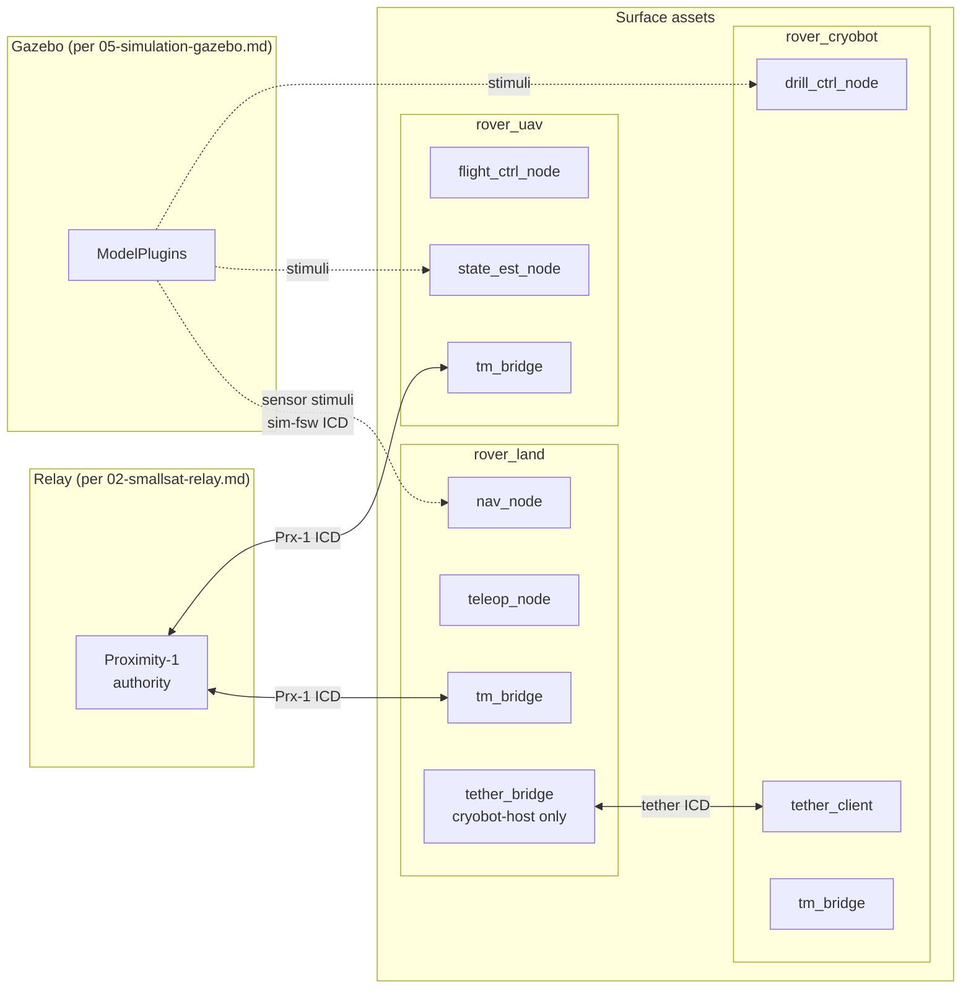

# 04 — Surface Rovers (Space ROS 2)

> Terminology: [../GLOSSARY.md](../GLOSSARY.md). Coding conventions: [.claude/rules/ros2-nodes.md](../../.claude/rules/ros2-nodes.md), [.claude/rules/general.md](../../.claude/rules/general.md). System context: [00-system-of-systems.md](00-system-of-systems.md). Protocol stack: [07-comms-stack.md](07-comms-stack.md). Time: [08-timing-and-clocks.md](08-timing-and-clocks.md). Scaling: [10-scaling-and-config.md](10-scaling-and-config.md). APID registry: [../interfaces/apid-registry.md](../interfaces/apid-registry.md). Packet bodies: [../interfaces/packet-catalog.md](../interfaces/packet-catalog.md). Upstream boundary: [../interfaces/ICD-relay-surface.md](../interfaces/ICD-relay-surface.md). Cryobot-specific link: [../interfaces/ICD-cryobot-tether.md](../interfaces/ICD-cryobot-tether.md). Sim boundary: [../interfaces/ICD-sim-fsw.md](../interfaces/ICD-sim-fsw.md). Decisions: [../standards/decisions-log.md](../standards/decisions-log.md).

This doc fixes the internal structure of the **three surface rover classes** — `rover_land` (wheeled), `rover_uav` (aerial), `rover_cryobot` (subsurface) — implemented as Space ROS 2 lifecycle-node compositions. Each rover is an independent deployable (one container per instance) running a small set of `rclcpp_lifecycle::LifecycleNode` components sharing a single process.

Segment scope: ROS 2 workspace at [`../../ros2_ws/`](../../ros2_ws/). Colcon-built, ament-packaged. Per-class, not per-instance: scaling from 1 to 5 `rover_land` in Scale-5 is launch-file parameterization per [10 §2](10-scaling-and-config.md), not new ROS packages.

## 1. Segment Context



Three load-bearing facts from the diagram:

1. **Every rover has a `tm_bridge` node** — the single responsibility of marshaling ROS 2 topics onto CCSDS Space Packets and vice versa. Everything else is ROS 2 internal.
2. **Cryobot talks to a rover-land-hosted `tether_bridge`** — cryobots do not have a Proximity-1 radio once tether-deployed per [ICD-cryobot-tether.md §1](../interfaces/ICD-cryobot-tether.md). The `tether_bridge` on the land rover forwards tether-bound SPPs to the cryobot and aggregates cryobot telemetry back onto Proximity-1.
3. **Simulation feeds sensor values via a separate boundary** ([ICD-sim-fsw.md](../interfaces/ICD-sim-fsw.md)) — ROS 2 nodes see simulated sensor messages as normal topic data; the sim-fsw sideband at the SPP layer is consumed by the `tm_bridge`, not by nav/control nodes.

## 2. Package Layout

Current ROS 2 workspace contents (from [`../../ros2_ws/src/`](../../ros2_ws/src/)):

```
ros2_ws/src/
├── rover_bringup/   — launch files + parameter YAML for composing rover processes
└── rover_teleop/    — reference lifecycle-node teleop (canonical template)
```

The `rover_teleop` package is the **canonical template** for future lifecycle nodes in this repo. It demonstrates every required pattern: `rclcpp_lifecycle::LifecycleNode` subclass, all five lifecycle callbacks implemented, QoS defined as a file-scope named constant, non-blocking timer callback, `RCLCPP_INFO` via `get_logger()`. See [`teleop_node.cpp`](../../ros2_ws/src/rover_teleop/src/teleop_node.cpp) for the reference implementation and [.claude/rules/ros2-nodes.md](../../.claude/rules/ros2-nodes.md) for the normative rules.

Planned growth per [REPO_MAP.md §ros2_ws](../REPO_MAP.md):

```
ros2_ws/src/
├── rover_common/     — msg types (Hk, Tc, LinkState, SimFault), shared QoS profiles, tm_bridge helper
├── rover_land/       — wheeled-rover nodes (nav, locomotion, tether_bridge opt)
├── rover_uav/        — aerial-rover nodes (flight ctrl, state est)
├── rover_cryobot/    — subsurface-rover nodes (drill ctrl, tether client)
├── rover_bringup/    — (existing) composite launch for any rover class
└── rover_teleop/     — (existing) operator interface (retained as teleop-only)
```

Naming is strict: `rover_<class>` is the package for the **class**, not the instance. Five `rover_land` instances in Scale-5 all use the same package, launched with different namespaces via `rover_bringup`.

## 3. Lifecycle Node Conventions

[.claude/rules/ros2-nodes.md](../../.claude/rules/ros2-nodes.md) is the normative reference. Summary (not restated here) with SAKURA-II-specific reinforcement:

| Rule | Enforcement |
|---|---|
| Subclass `rclcpp_lifecycle::LifecycleNode`; plain `rclcpp::Node` banned | Code review + grep `grep -rn "rclcpp::Node " ros2_ws/src/*/src/*.cpp` must return empty |
| Implement all five lifecycle callbacks | Colcon test: configure → activate → deactivate → cleanup round trip is mandatory |
| Non-blocking callbacks | Review per PR; offload heavy work to callback groups or separate threads |
| QoS as file-scope named constant | See [`teleop_node.cpp`](../../ros2_ws/src/rover_teleop/src/teleop_node.cpp) line 13 for the reference pattern |
| Log via `RCLCPP_INFO(get_logger(), ...)` only | grep `std::cout\|printf\|fprintf` in `ros2_ws/src/` must return empty |

The lifecycle-first posture is inherited from Space ROS — it lets an operator externally commanding a rover's `configure → activate` transitions without relying on the ROS 2 node's own internal state machine. In SAKURA-II, the ground-station backend drives these transitions via TCs translated to `ros2 lifecycle` commands inside the rover container (mechanism detail TBR with `tm_bridge` design).

## 4. Per-Class Node Compositions

### 4.1 `rover_land` (wheeled)

| Node | Role | Publishes | Subscribes |
|---|---|---|---|
| `nav_node` | Path planning, local nav, obstacle avoid | `/cmd_vel` | `/scan`, `/odom`, `/goal_pose` |
| `locomotion_node` | Wheel-speed resolution; motor driver interface | `/wheel_cmd` | `/cmd_vel` |
| `teleop_node` | Operator-driven velocity override | `/cmd_vel` (priority mux) | `/teleop/twist` |
| `tm_bridge` | CCSDS SPP ⇄ ROS 2 topic marshaling | Prx-1 SPPs (via socket) | `/hk_*`, `/cmd_*` topics |
| `tether_bridge` (optional; cryobot-host instance only) | Forwards SPPs to/from tether client | tether bytes | forwarded SPP topic |

APID block: `0x300`–`0x33F` per [apid-registry.md](../interfaces/apid-registry.md). HK packet is `PKT-TM-0300-0002` per [packet-catalog.md](../interfaces/packet-catalog.md).

### 4.2 `rover_uav` (aerial)

| Node | Role | Publishes | Subscribes |
|---|---|---|---|
| `state_est_node` | IMU / GPS / barometer fusion to pose estimate | `/pose`, `/vel_est` | `/imu`, `/gps`, `/baro` |
| `flight_ctrl_node` | Waypoint tracking, attitude control | `/motor_cmd` | `/pose`, `/waypoint` |
| `teleop_node` | Operator override | `/waypoint` | `/teleop/waypoint` |
| `tm_bridge` | CCSDS SPP ⇄ ROS 2 | Prx-1 SPPs | HK / cmd topics |

APID block: `0x340`–`0x37F`. Real-time constraint on `flight_ctrl_node`: inner-loop control at 100 Hz, non-blocking, with its own callback group on a reentrant executor.

### 4.3 `rover_cryobot` (subsurface)

| Node | Role | Publishes | Subscribes |
|---|---|---|---|
| `drill_ctrl_node` | Drill actuation, thermal management | `/drill_cmd_actual` | `/drill_cmd`, `/thermal` |
| `tether_client` | Tether-facing packet I/O; speaks HDLC-lite per [ICD-cryobot-tether.md](../interfaces/ICD-cryobot-tether.md) | tether bytes (via serial/socket) | tether-bound SPP topic |
| `tm_bridge` | CCSDS SPP ⇄ ROS 2 (tether-transit only) | local SPPs to `tether_client` | HK / cmd topics |

APID block: `0x380`–`0x3BF`. BW-collapse mode handling ([ICD-cryobot-tether.md §4](../interfaces/ICD-cryobot-tether.md)) is `tether_client`'s responsibility; other nodes are unaware of tether state.

## 5. QoS Profiles (shared)

Per [.claude/rules/ros2-nodes.md](../../.claude/rules/ros2-nodes.md), QoS profiles are **named constants at file scope**, not inline literals. SAKURA-II's shared QoS profiles live in a future `rover_common` header (`rover_common/qos.hpp`); until that package exists, each rover-class package duplicates the profile with a comment pointing to this doc.

| Profile | Reliability | History | Depth | Use for |
|---|---|---|---|---|
| `SENSOR_QOS` | Best effort | Keep last | 5 | High-rate sensor topics (`/scan`, `/imu`) where stale data is worse than lost data |
| `CMD_QOS` | Reliable | Keep last | 10 | Commanded-behavior topics (`/cmd_vel`, `/drill_cmd`) |
| `HK_QOS` | Reliable | Keep last | 1 | Rover HK (1 Hz, one-in-flight is enough) |
| `TELEOP_QOS` (keep-all) | Reliable | Keep last | 10 | Operator-driven inputs |

Reference implementation: [`teleop_node.cpp:13`](../../ros2_ws/src/rover_teleop/src/teleop_node.cpp) for the `CMD_VEL_QOS` constant pattern.

## 6. Launch & Composition

`rover_bringup` is the single entry point for spinning up a rover process. Per [10 §3](10-scaling-and-config.md), every launch file takes the following parameters:

| Parameter | Type | Origin |
|---|---|---|
| `rover_id` | string | `_defs/mission.yaml` |
| `rover_class` | `{land, uav, cryobot}` | `_defs/mission.yaml` |
| `instance_id` | integer 1–255 | `_defs/mission.yaml` |
| `apid_tm_base`, `apid_tc_base` | hex | `_defs/mission.yaml` |
| `namespace` | string (default `/<rover_id>`) | computed |
| `use_sim_time` | bool | true in SITL, false in flight |

All rover containers of the same class use the same launch file; only parameter values differ per instance. No per-instance launch files — enforced by code review.

Composition: the rover process uses a **`rclcpp_components::ComponentContainer`** with the relevant nodes loaded as composable components. This lets nav/control nodes share a single executor (for intra-process topic transport) while still being independently configurable lifecycle nodes.

## 7. Time Handling

Per [08 §5.4](08-timing-and-clocks.md) and [Q-F4](../standards/decisions-log.md), rovers are **time slaves** below the relay. ROS 2 `use_sim_time` is `true` in SITL — the `/clock` topic is provided by the `clock_link_model` container (per [05-simulation-gazebo.md](05-simulation-gazebo.md)) translating the simulated TAI into a ROS 2 time base.

Outgoing SPPs built by `tm_bridge` carry CUC timestamps derived from the node's current `rclcpp::Time` call (translated from ROS time to TAI at the bridge). On sync loss to the relay (> 30 s per [Q-C5](../standards/decisions-log.md)), `tm_bridge` sets the time-suspect flag on all outgoing TM per [08 §4](08-timing-and-clocks.md).

Flight mode (no sim, real hardware) replaces `/clock` with a hardware-time source; the lifecycle contract and QoS profiles don't change.

## 8. Fault & Degraded-Mode Behavior

| Fault | Detector | Rover response |
|---|---|---|
| Prx-1 session LOS (> 30 s) | `tm_bridge` session state ([ICD-relay-surface.md §2](../interfaces/ICD-relay-surface.md)) | Continue nominal behavior (rovers are autonomy-capable); buffer outbound HK; set time-suspect on TM when TAI sync expires |
| Tether LOS (cryobot) | `tether_client` frame timeout | Transition to BW-collapse mode per [ICD-cryobot-tether.md §5](../interfaces/ICD-cryobot-tether.md); if sustained, enter cryobot safe mode (halt drill) |
| Node crash | `rclcpp_components` container + external supervisor | Process-level restart; lifecycle re-enters `UNCONFIGURED` |
| Callback blocking (rule violation detected) | (Manual review; no automated runtime check today) | Treated as a bug; fix required before merge per [.claude/rules/ros2-nodes.md](../../.claude/rules/ros2-nodes.md) |
| Sim-fault-injection APID received via `tm_bridge` | `tm_bridge` | Consume only in SITL builds; reject with event in flight builds (mirrors orbiter egress filter in [01 §11](01-orbiter-cfs.md)) |

ROS 2's native QoS-deadline violations, topic-drop counters, and lifecycle state are all surfaced in rover HK per [packet-catalog.md](../interfaces/packet-catalog.md).

## 9. Testing Conventions

Per [.claude/rules/testing.md](../../.claude/rules/testing.md) and [.claude/rules/ros2-nodes.md](../../.claude/rules/ros2-nodes.md):

- Every package has a `colcon test` target using `ament_add_gtest` or `launch_testing_ament_cmake`.
- **Minimum test**: a configure → activate → deactivate → cleanup lifecycle round trip for every lifecycle node.
- Do not spin a full DDS stack in unit tests — use `rclcpp::NodeOptions().use_intra_process_comms(true)` with a test executor. Reference: [`rover_teleop/test/test_teleop.cpp`](../../ros2_ws/src/rover_teleop/test/test_teleop.cpp).
- Failure-path tests are mandatory (e.g. configure with missing param → correct `FAILURE` return).

Flight-integration tests (actual Prx-1 communication with a relay) are not colcon-level tests; they're scenario-level and live under the simulation stack per [05-simulation-gazebo.md](05-simulation-gazebo.md).

## 10. Configuration

| Surface | What it controls |
|---|---|
| Launch files (`rover_bringup/launch/*.launch.py`) | Per-rover-instance parameters, namespaces, composition |
| `_defs/mission.yaml` | Per-instance metadata (id, class, APID base) — consumed by launch files |
| Per-package `config/*.yaml` | Per-class tuning (nav tolerances, QoS depths that differ from defaults) |
| Docker compose profile | Instance count per class per [10 §2](10-scaling-and-config.md) |

Rover nodes themselves read parameters only from the ROS 2 parameter server at startup (via `get_parameter()`); post-startup reconfiguration is handled through the lifecycle `configure` callback.

## 11. Traceability

| Normative claim | Section | Upstream source |
|---|---|---|
| LifecycleNode required; plain Node banned | §3 | [.claude/rules/ros2-nodes.md](../../.claude/rules/ros2-nodes.md) |
| Callbacks non-blocking; QoS as named constants | §3, §5 | [.claude/rules/ros2-nodes.md](../../.claude/rules/ros2-nodes.md) |
| `tm_bridge` is the sole ROS ⇄ SPP marshaler | §1, §4 | [ICD-relay-surface.md](../interfaces/ICD-relay-surface.md) |
| Cryobot tether terminus via `tether_bridge` on rover-land | §1, §4.1 | [ICD-cryobot-tether.md §1](../interfaces/ICD-cryobot-tether.md) |
| Per-class packages; per-instance via launch-file parameters | §2, §6 | [10 §3](10-scaling-and-config.md) |
| Time slaves below relay; `use_sim_time` in SITL | §7 | [Q-F4](../standards/decisions-log.md), [08 §5.4](08-timing-and-clocks.md) |
| Lifecycle round-trip test mandatory per package | §9 | [.claude/rules/ros2-nodes.md](../../.claude/rules/ros2-nodes.md) |

## 12. Decisions Referenced / Open Items

Referenced (resolved elsewhere):

- [Q-C5](../standards/decisions-log.md) Proximity-1 hailing / LOS — consumed by `tm_bridge`.
- [Q-C7](../standards/decisions-log.md) Star topology — rovers only talk to the relay.
- [Q-C9](../standards/decisions-log.md) HDLC-lite tether framing — consumed by cryobot's `tether_client`.
- [Q-F4](../standards/decisions-log.md) Time authority ladder — rovers are node 4, time slaves.

Open, tracked for follow-up:

- `rover_common` package materialization (msg types, shared QoS, `tm_bridge` helper) — required before the first non-teleop rover package lands.
- `tm_bridge` detailed design — how CCSDS SPPs are translated to/from ROS topics; TBR in a future doc or in `rover_common`.
- Real-HW time source (non-sim) — bind `/clock` to a hardware clock; TBR with flight-hardware schedule.
- Lifecycle-transition-over-TC command format — how operator TCs drive `ros2 lifecycle` transitions; mechanism TBR with `tm_bridge` design.

## 13. What this doc is NOT

- Not an ICD. Per-boundary packet bodies live in [../interfaces/](../interfaces/).
- Not a ROS 2 tutorial. The `rclcpp_lifecycle` API is standard; see upstream docs.
- Not the tether physical-layer story. That's [ICD-cryobot-tether.md](../interfaces/ICD-cryobot-tether.md).
- Not the Gazebo story. That's [05-simulation-gazebo.md](05-simulation-gazebo.md).
- Not a coding rulebook. Rules are in [.claude/rules/](../../.claude/rules/); this doc cites them.
