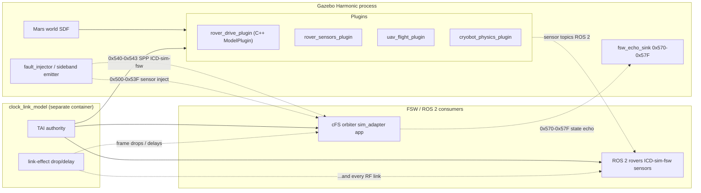

# 05 — Simulation Segment (Gazebo Harmonic)

> Terminology: [../GLOSSARY.md](../GLOSSARY.md). Coding conventions: [.claude/rules/general.md](../../.claude/rules/general.md). System context: [00-system-of-systems.md](00-system-of-systems.md). Protocol stack: [07-comms-stack.md](07-comms-stack.md). Time: [08-timing-and-clocks.md](08-timing-and-clocks.md). Scaling: [10-scaling-and-config.md](10-scaling-and-config.md). APID registry: [../interfaces/apid-registry.md](../interfaces/apid-registry.md). Packet bodies: [../interfaces/packet-catalog.md](../interfaces/packet-catalog.md). Sim ↔ FSW boundary: [../interfaces/ICD-sim-fsw.md](../interfaces/ICD-sim-fsw.md). Rover side: [04-rovers-spaceros.md](04-rovers-spaceros.md). Decisions: [../standards/decisions-log.md](../standards/decisions-log.md).

This doc fixes the internal structure of the **simulation segment** — a single Gazebo Harmonic instance running the Mars-surrogate world, the per-asset ModelPlugin suite, the clock/link sideband (`clock_link_model`), and the fault-injector that speaks the sim-fsw sideband at SPP APIDs `0x540`–`0x543`.

Segment scope: Gazebo world + plugins + clock shim. Source lives under [`../../simulation/`](../../simulation/); the sim-fsw boundary (the packet format, APID reservations, CRC-16 trailer rule) is in [ICD-sim-fsw.md](../interfaces/ICD-sim-fsw.md) — this doc covers the **sim-side plugins** that emit those packets.

Per [10 §2](10-scaling-and-config.md), all profiles run exactly one Gazebo container; multi-world parallelism is a deferred optimization.

## 1. Segment Context



Four load-bearing facts:

1. **Plugins serve two roles simultaneously.** They publish ROS 2 sensor messages (consumed by rover nodes per [04 §4](04-rovers-spaceros.md)) **and** can emit sim-fsw sideband SPPs (consumed by cFS orbiter via the `sim_adapter` app). The two paths do not share bytes — ROS 2 topics are ROS 2 topics; sideband SPPs carry their own CRC-16 trailer per [ICD-sim-fsw.md §1](../interfaces/ICD-sim-fsw.md).
2. **Sim is not a time authority.** The `clock_link_model` container is the TAI authority; Gazebo receives its sim-time tick from the clock model, not the other way. Per [08 §5.2](08-timing-and-clocks.md).
3. **Sim runs in a separate process from the clock model.** Gazebo's simulation is physics-heavy and best isolated from the deterministic clock/link logic. This lets us run the same clock model against a non-Gazebo scenario player for unit tests.
4. **Fault-inject APIDs `0x540`–`0x543` originate here** and are the only legal source. Any other source is rejected at the ground, relay, and cFS-egress per [02 §5.1](02-smallsat-relay.md) and [06 §8.2](06-ground-segment-rust.md).

## 2. Gazebo Choice Rationale

- **Gazebo Harmonic (not Gazebo Classic, not Ignition):** Harmonic is the current supported release line and aligns with Space ROS 2's recommended simulator. ModelPlugin API is stable.
- **C++17 ModelPlugin subclasses**, not SDF-only or Python bindings. Rationale: the simulation engineers share the C++17 toolchain with ROS 2, and plugin callbacks run in-process so Python overhead is not an option for 100+ Hz physics ticks.
- Reference implementation in-tree: [`simulation/gazebo_rover_plugin/`](../../simulation/gazebo_rover_plugin/) — specifically [`rover_drive_plugin.h`](../../simulation/gazebo_rover_plugin/include/rover_drive_plugin.h) shows the canonical shape. Plugins implement `Load()`, `Reset()`, and `OnUpdate()`; `OnUpdate()` must not block.

## 3. Plugin Inventory (planned)

One plugin per mechanical asset class. Plugins instance-parameterize through their SDF `<plugin>` element; one plugin class handles N model instances. Keeping docs per-class per [docs/README.md](../README.md) Conventions.

| Plugin | Role | Emits (ROS 2) | Emits (sim-fsw sideband) |
|---|---|---|---|
| `rover_drive_plugin` (exists) | Wheeled rover chassis dynamics; wheel-torque to velocity | `/odom`, `/wheel_state` | — |
| `rover_sensors_plugin` (planned) | IMU + GPS + scan on wheeled rovers | `/imu`, `/gps`, `/scan` | Optional injection on `0x500`–`0x51F` |
| `uav_flight_plugin` (planned) | Quadcopter/helicopter dynamics; motor-rate to pose | `/imu`, `/pose`, `/baro` | Optional injection on `0x520`–`0x52F` |
| `cryobot_physics_plugin` (planned) | Drill progress, thermal budget, tether spool | `/drill_state`, `/thermal` | Optional injection on `0x530`–`0x53F` |
| `world_plugin` (planned) | Global physics effects: dust, gravity anomalies, solar irradiance | Published to shared world topics | — |

### 3.1 Canonical plugin shape

Every plugin subclasses `gazebo::ModelPlugin` (or `WorldPlugin` for world-level) and follows the same skeleton (illustrated by the existing `rover_drive_plugin`):

```cpp
class MyPlugin : public ModelPlugin {
public:
    void Load(physics::ModelPtr model, sdf::ElementPtr sdf) override;
    void Reset() override;
private:
    void OnUpdate();   // non-blocking; called per physics step
    physics::ModelPtr     model_;
    event::ConnectionPtr  update_connection_;
};
GZ_REGISTER_MODEL_PLUGIN(MyPlugin)
```

`OnUpdate()` is hot-path. It:
- Reads physics state via `model_->GetWorldPose()`, joints, sensors.
- Publishes ROS 2 messages via an `rclcpp::Node` held inside the plugin (not a lifecycle node — plugin code isn't externally orchestrated).
- **Must not allocate on the hot path.** No `new`, no `std::vector::push_back` on unbounded vectors; pre-reserve in `Load()`.
- **Must not block.** No file I/O, no socket sync-write, no mutex that any other thread can hold for > 1 ms.

### 3.2 SDF usage

Plugin parameters come from the SDF `<plugin>` element, parsed inside `Load(sdf)`. Example SDF snippet:

```xml
<plugin name="rover_drive" filename="librover_drive_plugin.so">
  <max_torque>10.0</max_torque>
  <wheel_radius>0.15</wheel_radius>
  <sim_fsw_enable>true</sim_fsw_enable>
  <sim_fsw_apid>0x500</sim_fsw_apid>
</plugin>
```

Per-instance parameters (`sim_fsw_apid`) are driven by `_defs/mission.yaml` translated into SDF at launch time; plugins themselves never read YAML.

## 4. `fault_injector`

### 4.1 Role

A plugin (or standalone sidecar executable — TBR with the `sim_adapter` counterpart design) that emits sim-fsw sideband SPPs. Input: scenario commands. Output: SPPs on APIDs `0x540`–`0x543` per [ICD-sim-fsw.md §3](../interfaces/ICD-sim-fsw.md).

Four minimum fault types per [Q-F2](../standards/decisions-log.md):

| APID | Fault | Target | Sim-side effect |
|---|---|---|---|
| `0x540` | Packet drop | Specific APID, rate | `fault_injector` tells `clock_link_model` to drop matching frames |
| `0x541` | Clock skew | Asset, magnitude | `fault_injector` tells `clock_link_model` to advance/retard local time for the target asset |
| `0x542` | Force safe-mode | Orbiter | Delivered to cFS `sim_adapter`; cFS dispatches to mode manager |
| `0x543` | Sensor-noise corruption | Specific sensor topic, amplitude | Plugin override: add noise to the named sensor output |

### 4.2 Scenario source

Scenarios are declarative YAML files under `simulation/scenarios/*.yaml` (planned). Each scenario enumerates a timeline of fault events against simulated TAI. Example:

```yaml
scenario: SCN-OFF-02-relay-occlusion
duration_s: 600
events:
  - at_tai_s: 120
    inject: packet_drop
    target_apid: 0x200
    rate: 0.5
  - at_tai_s: 240
    inject: clock_skew
    asset: orbiter-01
    magnitude_ms: 100
```

`fault_injector` walks the scenario timeline using simulated TAI (sourced from `clock_link_model`), emitting sideband SPPs at the scheduled times. Scenario files are **not** read at runtime by plugins — they're loaded by `fault_injector` at boot, validated, and converted to an event queue.

### 4.3 CRC-16 trailer

Per [ICD-sim-fsw.md §1](../interfaces/ICD-sim-fsw.md): the in-process transport (shared-memory or UDS) has no frame CRC, so every sim-fsw sideband SPP carries its own **CRC-16/CCITT-FALSE trailer** — the last 2 bytes of the user-data field. `fault_injector` computes the CRC at emission; `sim_adapter` on the FSW side validates before `CFE_SB_Publish`.

### 4.4 Flight-build guard

Per [ICD-sim-fsw.md §5.2](../interfaces/ICD-sim-fsw.md), the `CFS_FLIGHT_BUILD` compile-time flag **must** make the entire `0x500`–`0x57F` APID block unreachable in non-SITL builds. The sim container itself is simply not shipped in a flight image; the guard is the defense-in-depth belt on the FSW side. This doc asserts the sim-side emission is well-defined; the responsibility to reject accidental emission on RF rests with the orbiter's TO egress filter ([01 §11](01-orbiter-cfs.md)) and the ground's `ApidRouter` ([06 §5.4](06-ground-segment-rust.md)).

## 5. Clock / Link Sideband

### 5.1 `clock_link_model` boundary

The `clock_link_model` container (separate from Gazebo, per [10 §2](10-scaling-and-config.md)) provides:

| Service | Consumers | Mechanism |
|---|---|---|
| Simulated TAI clock | Everyone (Gazebo, FSW, ROS 2) | Periodic time-sync packets on the SB + ROS 2 `/clock` |
| Frame drop model | RF-like boundaries (AOS, Prx-1) | Parameterized drop rate + loss pattern |
| Inter-asset delay | Same boundaries | Fixed or distribution-sampled delay per asset pair |
| BW-collapse mode | Cryobot tether | 100 kbps mode trigger per [ICD-cryobot-tether.md §5](../interfaces/ICD-cryobot-tether.md) |

### 5.2 What Gazebo does and doesn't do

- **Does:** run physics at its own rate, synchronized against the clock model's tick (via ROS 2 `/clock` or shared-mem handshake — TBR with clock-model impl).
- **Does not:** decide time of day, decide when to drop frames, decide inter-asset delay.

Separating physics from clock/link keeps the "what is reality" question (Gazebo's physics) orthogonal to the "what gets delivered through the sim-fsw and RF boundaries" question (clock_link_model). This lets us run deterministic scenario tests with a mock Gazebo (e.g. scripted pose streams) when physics isn't the subject under test.

## 6. Source Tree Layout

Current:

```
simulation/
└── gazebo_rover_plugin/        — wheeled-rover drive (reference plugin)
    ├── CMakeLists.txt
    ├── include/
    │   └── rover_drive_plugin.h
    └── src/
        └── rover_drive_plugin.cpp
```

Planned:

```
simulation/
├── gazebo_rover_plugin/        — (existing, generalize to class-wide)
├── gazebo_uav_plugin/          — aerial rover dynamics
├── gazebo_cryobot_plugin/      — cryobot physics + tether spool
├── gazebo_world_plugin/        — dust, gravity, irradiance
├── fault_injector/             — scenario runner → sim-fsw sideband emitter
├── scenarios/                  — *.yaml scenario timelines
└── worlds/                     — *.sdf mars-surrogate world definitions
```

Each plugin directory is independently buildable via CMake. No dynamic allocation restriction applies here — simulation is host-side, not flight — but the **`OnUpdate` hot-path no-alloc rule** is still enforced as a performance guardrail ([.claude/rules/general.md](../../.claude/rules/general.md) early-return / nesting rules apply).

## 7. Testing Conventions

- Per-plugin unit tests run the plugin against a mock physics engine where possible (Gazebo's `gtest` integration), or a fixture that feeds synthetic `OnUpdate` calls.
- Scenario-level integration tests run the full stack (Gazebo + clock_link_model + cFS + ground_station) in Docker, driven by a scenario file. Scenarios under `simulation/scenarios/` are themselves artifacts under version control.
- Coverage target per [.claude/rules/testing.md](../../.claude/rules/testing.md) applies where meaningful (plugin internal logic); physics-engine-bound behavior is validated via scenario tests, not line coverage.

Minimum gate: every plugin has a "loads without crash" test that exercises `Load()` + `Reset()` + 10 iterations of `OnUpdate()` with a synthetic model pointer.

## 8. Fault & Degraded-Mode Behavior

| Fault | Detector | Response |
|---|---|---|
| Plugin `Load()` fails (missing SDF param) | Gazebo framework | Plugin disabled; log via `gzerr`; Gazebo keeps running |
| `OnUpdate()` throws / crashes | Gazebo framework | Plugin isolated; Gazebo keeps running but that asset's physics is frozen |
| Scenario file validation fail | `fault_injector` at boot | Abort startup; emit `SCENARIO-INVALID` with parse error |
| `sim_adapter` backpressure (SPP rejected on FSW side) | `fault_injector` | Log + retry once; if persistent, drop and increment `fault_injector_dropped_total` |
| CRC-16 mismatch at `sim_adapter` | (FSW-side detection) | FSW drops + events per [ICD-sim-fsw.md](../interfaces/ICD-sim-fsw.md); sim side is oblivious unless echo protocol surfaces it |

Sim is a **test harness**; faults in sim behavior are bugs in scenario authoring or plugin code, not mission-critical events. No safe-mode behavior applies on the sim side.

## 9. Configuration

| Surface | What it controls |
|---|---|
| SDF world file (`simulation/worlds/*.sdf`) | World-level physics, assets to load |
| SDF `<plugin>` elements | Per-plugin params (torque limits, sensor models) |
| `_defs/mission.yaml` | Per-instance asset metadata → SDF substitution at launch |
| Scenario YAML (`simulation/scenarios/*.yaml`) | Fault-injection timelines for `fault_injector` |
| Docker compose | Single Gazebo container across all profiles per [10 §2](10-scaling-and-config.md) |

## 10. Traceability

| Normative claim | Section | Upstream source |
|---|---|---|
| Gazebo Harmonic + C++17 ModelPlugin | §2 | [CLAUDE.md](../../CLAUDE.md), [REPO_MAP.md §simulation/](../REPO_MAP.md) |
| Per-plugin class, per-instance via SDF | §3, §9 | [docs/README.md](../README.md) conventions |
| `OnUpdate()` non-blocking, no-alloc on hot path | §3.1 | [.claude/rules/general.md](../../.claude/rules/general.md) |
| Sim-fsw sideband APIDs `0x500`–`0x57F`, fault-inject `0x540`–`0x543` | §4 | [Q-F2](../standards/decisions-log.md), [ICD-sim-fsw.md](../interfaces/ICD-sim-fsw.md) |
| CRC-16/CCITT-FALSE trailer on every sim-fsw SPP | §4.3 | [ICD-sim-fsw.md §1](../interfaces/ICD-sim-fsw.md) |
| `CFS_FLIGHT_BUILD` guard makes sim-APID block unreachable in flight | §4.4 | [ICD-sim-fsw.md §5.2](../interfaces/ICD-sim-fsw.md) |
| Sim is not a time authority; takes clock from `clock_link_model` | §5.2 | [08 §5.2](08-timing-and-clocks.md) |

## 11. Decisions Referenced / Open Items

Referenced (resolved elsewhere):

- [Q-F1](../standards/decisions-log.md) Functional fault-injection transport (cFE SB via sim_adapter) — this doc covers sim-side emission into that transport.
- [Q-F2](../standards/decisions-log.md) Minimum fault set (four APIDs) — consumed in §4.1.
- [Q-F4](../standards/decisions-log.md) Time authority ladder — sim is **not** in the ladder; the `clock_link_model` is authoritative for simulated TAI.

Open, tracked for follow-up:

- `fault_injector` implementation choice (Gazebo plugin vs. standalone sidecar) — TBR with `sim_adapter` design.
- Scenario YAML schema — will live under `simulation/scenarios/README.md` or equivalent when `fault_injector` lands.
- Transport choice (shared-mem vs UDS) for the sim-fsw sideband — `sim_adapter` config parameter, not fixed here per [ICD-sim-fsw.md §1](../interfaces/ICD-sim-fsw.md).
- Multi-world parallelism for scale-out — deferred per [10 §2](10-scaling-and-config.md).
- Hardware-in-the-loop (HIL) variant that replaces Gazebo with a hardware sensor stub — out of scope for Phase B.

## 12. What this doc is NOT

- Not a Gazebo tutorial. See the Gazebo Harmonic docs.
- Not an ICD. Packet layouts at the sim-fsw boundary live in [ICD-sim-fsw.md](../interfaces/ICD-sim-fsw.md) and [packet-catalog §7](../interfaces/packet-catalog.md).
- Not the clock/link model spec. That lives with `clock_link_model`'s implementation; the boundary is in [08-timing-and-clocks.md](08-timing-and-clocks.md) and [07 §9](07-comms-stack.md).
- Not the FSW-side reception story. The `sim_adapter` app is cFS-side and is scoped by [01-orbiter-cfs.md](01-orbiter-cfs.md) + [ICD-sim-fsw.md](../interfaces/ICD-sim-fsw.md).
- Not a coding rulebook. Rules are in [.claude/rules/](../../.claude/rules/).
