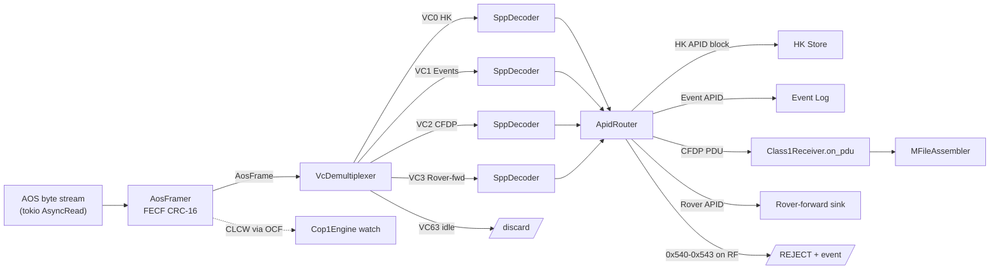
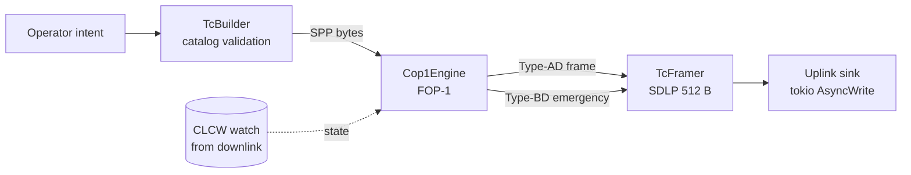
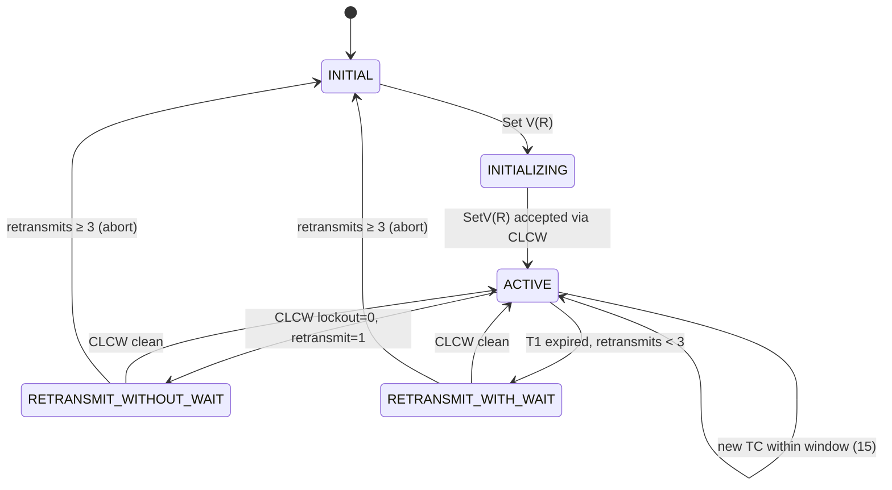

# 06 — Ground Segment (Rust)

> Terminology: [../GLOSSARY.md](../GLOSSARY.md). Bibliography: [../standards/references.md](../standards/references.md). Upstream protocol stack: [07-comms-stack.md](07-comms-stack.md). Timestamp format: [08-timing-and-clocks.md](08-timing-and-clocks.md) §2. Packet bodies: [../interfaces/packet-catalog.md](../interfaces/packet-catalog.md). APID registry: [../interfaces/apid-registry.md](../interfaces/apid-registry.md). Scaling / config surfaces: [10-scaling-and-config.md](10-scaling-and-config.md). Authoritative decisions: [../standards/decisions-log.md](../standards/decisions-log.md). Relay ↔ surface M-File source: [../interfaces/ICD-relay-surface.md](../interfaces/ICD-relay-surface.md) §6 (planned, Batch B2).

This doc is the **definition site** for [Q-C3](../standards/decisions-log.md) (the `CfdpProvider` trait boundary wrapping `cfdp-core`) and [Q-C8](../standards/decisions-log.md) (big-endian wire encoding, with `ccsds_wire` + `cfs_bindings` as the only Rust-side conversion loci). It fixes the Rust-side contract for the three ground-segment crates — `rust/ccsds_wire/`, `rust/cfs_bindings/`, `rust/ground_station/` — in enough detail that the Phase C Step 2 scaffolding PR can be implemented and gated without further architecture work.

Scope: crate boundaries and public types; the ingest (AOS → SPP → catalog) and uplink (catalog → COP-1 → AOS) pipelines; the CFDP Class 1 provider; M-File reassembly; the cargo-based acceptance gate. This doc does **not** contain runnable code — only types, trait signatures, stage tables, and normative behavior.

## 1. Workspace Layout

### 1.1 Crate tree

Three crates under `rust/`, each with a single responsibility:

| Crate | Role | Edition | Downstream | Upstream deps |
|---|---|---|---|---|
| `rust/ccsds_wire/` | Pure-Rust CCSDS primary/secondary header + CUC pack/unpack. Only std; `#![forbid(unsafe_code)]`. Q-C8 locus A. | 2021 | `ground_station`, `cfs_bindings` | `thiserror` only |
| `rust/cfs_bindings/` | FSW-adjacent FFI + host-endian ↔ `ccsds_wire` helpers. Q-C8 locus B. | 2021 | `ground_station` | `bindgen` (build-only), `ccsds_wire`, `log` |
| `rust/ground_station/` | TM ingest, TC uplink, COP-1, CFDP provider, M-File assembly, operator-UI backend. Binary crate. | 2021 | — | `ccsds_wire`, `cfs_bindings`, `cfdp-core`, `tokio`, `bytes`, `crc`, `thiserror`, `anyhow`, `log`, `env_logger`, `serde` |

No other Rust crates are part of SAKURA-II Phase B. The `_defs/mission_config.h` header is consumed by `cfs_bindings` via `bindgen`; no other crate reads it.

### 1.2 Workspace `Cargo.toml` delta

The existing root [`Cargo.toml`](../../Cargo.toml) declares two members (`rust/ground_station`, `rust/cfs_bindings`) and three shared deps (`anyhow`, `log`, `env_logger`). The scaffolding PR MUST apply these additive changes — no removals:

| Section | Additions |
|---|---|
| `[workspace]` members | `"rust/ccsds_wire"` |
| `[workspace.dependencies]` | `cfdp-core` (version pinned in scaffolding PR), `tokio = { version = "1", features = ["sync","rt-multi-thread","macros","time"] }`, `bytes = "1"`, `thiserror = "1"`, `crc = "3"`, `proptest = "1"`, `serde = { version = "1", features = ["derive"] }` |
| `[workspace.lints.rust]` | `unsafe_code = "deny"` at workspace root; `cfs_bindings` MAY override to `"allow"` for the bindgen include only |
| `[workspace.lints.clippy]` | `all = "deny"`, `pedantic = "warn"`, `unwrap_used = "deny"`, `expect_used = "deny"`, `panic = "deny"`, `indexing_slicing = "warn"`, `cast_lossless = "warn"`, `missing_errors_doc = "warn"`, `missing_panics_doc = "warn"` |

### 1.3 Toolchain pin

A new `rust-toolchain.toml` at repo root MUST declare:

```toml
[toolchain]
channel    = "stable"
components = ["rustfmt", "clippy"]
```

No `nightly`-only features are permitted in any workspace member. This keeps the Ferrocene-compatible-target door open per [CLAUDE.md](../../CLAUDE.md).

### 1.4 `.cargo/config.toml`

A new `.cargo/config.toml` at repo root declares only:

```toml
[build]
rustflags = ["-D", "warnings"]
```

Ferrocene cross-target selection (`[target.<triple>]` blocks) is **out of scope** for this doc; the seam is that no crate uses nightly-only features and std-only is sufficient, so a future `.cargo/config.toml` target swap is additive.

### 1.5 BE-wrapper decision

| Option | Outcome | Rationale |
|---|---|---|
| Pure std + sealed newtypes, `#![forbid(unsafe_code)]` | **Adopted** | No deps; only path to a byte is through a typed accessor; smallest audit surface; Ferrocene-compatible-target friendly. |
| [`zerocopy`] derives with `Ref<&[u8], Header>` | Rejected | Upstream `unsafe` internals; derive-macro qualification path is TBR. |
| [`byteorder`] crate helpers | Rejected | Adds a dependency for what `u16::from_be_bytes` / `u16::to_be_bytes` already do in std. |

[`zerocopy`]: https://crates.io/crates/zerocopy
[`byteorder`]: https://crates.io/crates/byteorder

### 1.6 Migration of existing `ground_station::telemetry`

The existing BE-only CCSDS primary-header parser in [`rust/ground_station/src/telemetry.rs`](../../rust/ground_station/src/telemetry.rs) is the functional seed for `ccsds_wire::primary_header`: the scaffolding PR MUST move that type, its error enum, and its unit tests into `ccsds_wire`, and replace the direct consumer with `use ccsds_wire::PrimaryHeader`. After the migration, `ground_station/src/telemetry.rs` is either removed or reduced to a thin shim re-exporting `ccsds_wire` types. No BE parsing logic remains outside `ccsds_wire` + `cfs_bindings` on the Rust side — per [Q-C8](../standards/decisions-log.md).

## 2. `ccsds_wire` API

### 2.1 Design principles

- All multi-byte header fields are **big-endian** on the wire. Per [Q-C8](../standards/decisions-log.md).
- No public `u16`/`u32` fields on any header type. The only access path to a wire value is through a sealed newtype accessor; the only access path to bytes is through `encode`/`decode`.
- `SpacePacket<'a>` is a **borrowed view** over caller-owned bytes — no allocation on the hot path.
- Crate root carries `#![forbid(unsafe_code)]` and `#![deny(clippy::all)]`.
- No dependency on `byteorder`, `zerocopy`, or `bytes`. Only `thiserror` for error ergonomics.

### 2.2 Newtype primitives

| Type | Invariants |
|---|---|
| `Apid(u16)` | `0x000..=0x7FF` (11-bit); `Apid::IDLE == 0x7FF`. |
| `SequenceCount(u16)` | `0..=0x3FFF` (14-bit). |
| `PacketDataLength(u16)` | Raw `total_length − 7` per CCSDS 133.0-B-2. Decode validates against buffer length. |
| `FuncCode(u16)` | `0x0000` is reserved (null) and rejected on decode. |
| `InstanceId(u8)` | `1..=255`; `0` reserved (broadcast sentinel). |
| `PacketType` | enum `Tm` (`0`) / `Tc` (`1`). |

All constructors are fallible and return `Result<Self, CcsdsError>`. All accessors return the newtype; a caller needing a raw integer calls `.get()` explicitly, which makes every LE-conversion site visible to grep audits.

### 2.3 `Cuc` encoder/decoder

```rust
pub struct Cuc {
    pub coarse: u32, // seconds since TAI epoch 1958-01-01
    pub fine: u16,   // 2^-16 s (≈ 15.26 µs)
}

impl Cuc {
    pub const P_FIELD: u8 = 0x2F;
    pub fn encode_be(&self, out: &mut [u8; 7]);
    pub fn decode_be(buf: &[u8]) -> Result<Self, CcsdsError>;
}
```

`encode_be` writes the fixed P-Field `0x2F` (per [Q-C6](../standards/decisions-log.md) and [08 §2](08-timing-and-clocks.md)) as byte 0, coarse seconds as bytes 1–4 big-endian, fine as bytes 5–6 big-endian. `decode_be` MUST reject any P-Field ≠ `0x2F` with `CcsdsError::InvalidPField`.

### 2.4 `PrimaryHeader`

```rust
pub struct PrimaryHeader { /* private fields */ }

impl PrimaryHeader {
    pub const LEN: usize = 6;

    pub fn apid(&self) -> Apid;
    pub fn packet_type(&self) -> PacketType;
    pub fn sequence_count(&self) -> SequenceCount;
    pub fn data_length(&self) -> PacketDataLength;

    pub fn decode(buf: &[u8]) -> Result<Self, CcsdsError>;
    pub fn encode(&self, out: &mut [u8; Self::LEN]);
}
```

`decode` enforces: version bits `[7:5]` of byte 0 are `0b000` (else `InvalidVersion`); sequence flags are `0b11` standalone (else `SequenceFlagsNotStandalone`); APID in range (else `ApidOutOfRange`). Secondary-header flag MUST be `1` — SAKURA-II never omits the time tag ([07 §2](07-comms-stack.md)).

### 2.5 `SecondaryHeader`

```rust
pub struct SecondaryHeader { /* private fields */ }

impl SecondaryHeader {
    pub const LEN: usize = 10;

    pub fn time(&self) -> Cuc;
    pub fn func_code(&self) -> FuncCode;
    pub fn instance_id(&self) -> InstanceId;

    /// Bit 0 of TM func_code is the time-suspect flag ([08 §4](08-timing-and-clocks.md)).
    pub fn time_suspect(&self) -> bool;

    pub fn decode(buf: &[u8]) -> Result<Self, CcsdsError>;
    pub fn encode(&self, out: &mut [u8; Self::LEN]);
}
```

Layout: 7 B CUC, 2 B BE func code, 1 B instance ID. Total 10 B per [Q-C6](../standards/decisions-log.md).

### 2.6 `SpacePacket<'a>` — borrowed view

```rust
pub struct SpacePacket<'a> {
    pub primary:   PrimaryHeader,
    pub secondary: SecondaryHeader,
    pub user_data: &'a [u8],
}

impl<'a> SpacePacket<'a> {
    pub const HEADER_LEN: usize = 16; // 6 + 10

    pub fn parse(buf: &'a [u8]) -> Result<Self, CcsdsError>;
    pub fn total_len(&self) -> usize;
}
```

`parse` validates buffer length against the declared `data_length`: `primary.data_length().get() as usize + 7 == buf.len()`. A mismatch returns `LengthMismatch { declared, actual }`.

### 2.7 `PacketBuilder`

```rust
pub struct PacketBuilder { /* private */ }

impl PacketBuilder {
    pub fn tm(apid: Apid) -> Self;
    pub fn tc(apid: Apid) -> Self;

    pub fn func_code(self, fc: FuncCode) -> Self;
    pub fn instance_id(self, id: InstanceId) -> Self;
    pub fn cuc(self, t: Cuc) -> Self;
    pub fn sequence_count(self, sc: SequenceCount) -> Self;
    pub fn user_data(self, data: &[u8]) -> Self;

    pub fn build(self) -> Result<Vec<u8>, CcsdsError>;
}
```

`build` computes `data_length` from user data size plus secondary-header length (`10 + user_data.len() − 1`), encodes all fields BE, and returns an owned `Vec<u8>`. Per-boundary size ceilings (e.g. 1008 B max user data over AOS VC 0/1 from [07 §2](07-comms-stack.md)) are the caller's responsibility; `build` enforces only the hard `data_length < 0x10000` CCSDS cap.

### 2.8 `CcsdsError`

```rust
#[derive(Debug, Error, PartialEq, Eq)]
pub enum CcsdsError {
    #[error("buffer too short: need {need}, got {got}")]
    BufferTooShort { need: usize, got: usize },
    #[error("invalid CCSDS version: {0}")]
    InvalidVersion(u8),
    #[error("invalid CUC P-Field: 0x{0:02X} (expected 0x2F)")]
    InvalidPField(u8),
    #[error("APID out of range: 0x{0:03X}")]
    ApidOutOfRange(u16),
    #[error("instance id 0 is reserved")]
    InstanceIdReserved,
    #[error("declared data_length {declared} does not match buffer length {actual}")]
    LengthMismatch { declared: usize, actual: usize },
    #[error("sequence flags not standalone (0b11): 0b{0:02b}")]
    SequenceFlagsNotStandalone(u8),
    #[error("function code 0x0000 is reserved")]
    FuncCodeReserved,
}
```

Exhaustive; `#[non_exhaustive]` is **not** applied — adding a variant is a semver-breaking API change that requires a doc update.

### 2.9 Silent-LE guard

No public `u16`/`u32` fields on any header type. The only BE conversion sites in Rust **outside** of `ccsds_wire` live in `cfs_bindings` — nowhere else. CI MUST enforce:

```
rg 'from_le_bytes|to_le_bytes' rust/ -g '!target'   →  0 matches
```

A non-zero result fails the build (implemented as a pre-merge check in the scaffolding PR).

### 2.10 Proptest properties

The following property-test names are normative — the scaffolding PR MUST commit tests under these exact names in `rust/ccsds_wire/tests/proptests.rs`:

| Property | Claim |
|---|---|
| `prop_primary_header_roundtrip` | `PrimaryHeader::decode(encode(x)) == x` for all valid `(apid, type, seq, len)`. |
| `prop_secondary_header_roundtrip` | Same for `SecondaryHeader`. |
| `prop_cuc_roundtrip` | Same for `Cuc` over random `(coarse ∈ u32, fine ∈ u16)`. |
| `prop_space_packet_roundtrip` | `SpacePacket::parse(PacketBuilder::...build()?)` reproduces the original components. |
| `prop_rejects_short_buffer` | A buffer shorter than the declared total length returns `BufferTooShort`. |
| `prop_rejects_invalid_version` | Any non-zero version field returns `InvalidVersion`. |
| `prop_rejects_invalid_pfield` | Any P-Field ≠ `0x2F` in a CUC position returns `InvalidPField`. |

## 3. `cfs_bindings` Scope

### 3.1 Present scope

The existing crate at [`rust/cfs_bindings/`](../../rust/cfs_bindings/) invokes `bindgen` (build-dep only) to emit Rust constants from [`_defs/mission_config.h`](../../_defs/mission_config.h) (`SPACECRAFT_ID`, `SAMPLE_MISSION_MAX_PIPES`, `SAMPLE_MISSION_TASK_STACK`). The safe-wrapper `mission` module validates the 11-bit APID invariant on `SPACECRAFT_ID`.

### 3.2 Expanded scope (scaffolding PR)

The scaffolding PR expands `cfs_bindings` to include safe wrappers around the cFS message types it needs to interoperate with (`CFE_MSG_Message_t`, `CFE_SB_Buffer_t`, app-level command/telemetry structs). These wrappers convert between host-endian C types and `ccsds_wire` types at the FFI boundary:

```
C side (host-endian struct) ←→ cfs_bindings wrapper ←→ ccsds_wire::SpacePacket (wire bytes)
```

`cfs_bindings` MUST NOT emit bytes directly to the network. Every byte that leaves ground over RF passes through `ccsds_wire::PacketBuilder` or `ccsds_wire`-owned encoders.

### 3.3 Out of scope for `cfs_bindings`

- No CFDP logic — that lives in `ground_station::cfdp`.
- No ingest or uplink pipelines — those live in `ground_station::{ingest, uplink}`.
- No operator UI — see §10.

## 4. `CfdpProvider` — Q-C3 Resolution

This section is the definition site for [Q-C3](../standards/decisions-log.md). The authoritative answer: **"Use the `cfdp-core` crate with a transport module. Boundary is the `CfdpProvider` trait in `rust/ground_station/src/cfdp/`. Class 1 implements `CfdpProvider` via `Class1Receiver`; Class 2 lands later as an additional implementation against the same trait."**

### 4.1 Shape

Two traits. The inner `CfdpReceiver` is the receive-path contract already committed in [07 §5.2](07-comms-stack.md) — its signature is **frozen** and MUST NOT change here. The outer `CfdpProvider: CfdpReceiver` adds the send path and the provider-level lifecycle.

`Class1Receiver` implements both. Class 2 will land as `Class2Provider` (also implementing both) in Phase C+.

### 4.2 Trait definitions

```rust
use ccsds_wire::Cuc;

#[derive(Debug, Copy, Clone, PartialEq, Eq, Hash)]
pub struct TransactionId(pub u64);

#[derive(Debug, thiserror::Error)]
pub enum CfdpError {
    #[error("pdu parse failed: {0}")]
    Parse(String),
    #[error("unknown transaction: {0:?}")]
    UnknownTransaction(TransactionId),
    #[error("transaction table full (capacity 16)")]
    CapacityExceeded,
    #[error("crc-32 mismatch for transaction {0:?}")]
    CrcMismatch(TransactionId),
    #[error("transaction {0:?} timed out")]
    Timeout(TransactionId),
    #[error("io: {0}")]
    Io(#[from] std::io::Error),
}

#[derive(Debug)]
pub enum TransactionOutcome {
    Completed { id: TransactionId, path: std::path::PathBuf, bytes: u64 },
    Abandoned { id: TransactionId, reason: String, bytes_received: u64 },
}

/// Receive-side contract. Signature frozen by [07 §5.2](07-comms-stack.md) — DO NOT CHANGE.
pub trait CfdpReceiver {
    fn on_pdu(&mut self, pdu: &[u8]) -> Result<(), CfdpError>;
    fn finalize_transaction(&mut self, id: TransactionId)
        -> Result<TransactionOutcome, CfdpError>;
}

/// Outer provider — resolves Q-C3. Wraps a `CfdpReceiver` plus the send path.
pub trait CfdpProvider: CfdpReceiver {
    /// Initiate a ground-originated send. Class 1 uses this today for
    /// (rare) ground-to-orbiter file pushes; Class 2 will reuse unchanged.
    fn send_file(
        &mut self,
        src: &std::path::Path,
        destination_entity_id: u16,
        remote_path: &str,
    ) -> Result<TransactionId, CfdpError>;

    /// Cancel an in-flight transaction (sender or receiver side).
    fn cancel(&mut self, id: TransactionId) -> Result<(), CfdpError>;

    /// Drive timeouts and emit outcomes. MUST be called at ≥ 1 Hz with the
    /// current TAI time; see §4.3 for timeout semantics.
    fn poll(&mut self, now: Cuc) -> Vec<TransactionOutcome>;

    /// Read-only snapshot of active transactions (for HK and operator UI).
    fn active_transactions(&self) -> Vec<TransactionId>;
}

/// Class 1 implementation. Wraps a `cfdp-core` Daemon and the transaction table.
pub struct Class1Receiver { /* private */ }

impl CfdpReceiver for Class1Receiver { /* ... */ }
impl CfdpProvider for Class1Receiver { /* ... */ }
```

### 4.3 Transaction model

| Parameter | Value | Source |
|---|---|---|
| Checksum | CRC-32 (IEEE 802.3 polynomial) | [Q-C2](../standards/decisions-log.md), [07 §5.1](07-comms-stack.md) |
| Max concurrent transactions | **16** | [07 §5.1](07-comms-stack.md) |
| Transaction timeout | **10 × OWLT** (OWLT from [10 §6](10-scaling-and-config.md) `mission.yaml`) | [07 §5.1](07-comms-stack.md) |
| Segment size (PDU) | 1024 B user data per File Data PDU | [07 §5.1](07-comms-stack.md) |
| Direction (Class 1) | Unidirectional (downlink-only in Phase B) | [07 §5.1](07-comms-stack.md) |
| On timeout | Emit `TransactionOutcome::Abandoned { id, reason, bytes_received }`, log `CFDP-TX-ABANDONED` event, evict entry on next `poll()` | this doc |
| On CRC mismatch (EOF) | Emit `TransactionOutcome::Abandoned`, log `CFDP-TX-CRC-MISMATCH`, keep partial file as `<id>.partial` | this doc |

Normative: `poll(now)` MUST evict any transaction whose `last_pdu_tai` age exceeds the timeout on each call; silent non-eviction is a bug.

### 4.4 Transaction table (private impl sketch)

The Class 1 implementation owns the following state (sketch — **not** part of the public API):

```text
struct TransactionState {
    started_tai:   Cuc,
    last_pdu_tai:  Cuc,
    metadata:      FileMetadata,
    received:      BitSet,       // chunk_index → received?
    total_chunks:  u32,
    partial_path:  PathBuf,
}

active: HashMap<TransactionId, TransactionState>  // capped at 16 per §4.3
```

Attempting to open a seventeenth transaction returns `CfdpError::CapacityExceeded`; the oldest in-flight transaction is **not** auto-evicted (operator intervention required).

### 4.5 `cfdp-core` adapter

| `CfdpProvider` method | `cfdp-core` call |
|---|---|
| `send_file(...)` | `cfdp_core::Daemon::send(...)` — Class 1 send path. |
| `on_pdu(...)` (via `CfdpReceiver`) | `cfdp_core::PduParser::decode(...)` → `Daemon::handle_pdu(...)` |
| `poll(now)` | `Daemon::tick(now_as_unix_epoch)` — drives timeouts and delivers completed transactions. |
| `cancel(id)` | `Daemon::cancel(id)` |

The adapter translates between `ccsds_wire::Cuc` (TAI epoch 1958) and `cfdp-core`'s expected time representation (typically Unix epoch) at exactly this boundary and nowhere else.

### 4.6 Class 2 seam

Class 2 (acknowledged mode with NAKs, checkpoints, EOF-Ack) will land as a second implementation of the same pair of traits — `Class2Provider: CfdpProvider + CfdpReceiver` — with no public-API change to callers. The trait is intentionally narrow to make this additive.

## 5. Ingest Pipeline (AOS → SPP → Catalog)

### 5.1 Flow



### 5.2 Stage table

| Stage | Owns | Input | Output | Error policy |
|---|---|---|---|---|
| `AosFramer` | Frame sync, FECF CRC-16/CCITT-FALSE, OCF extraction | bytes via tokio `AsyncRead` | `AosFrame { vc_id, ocf, data_field }` | FECF mismatch → discard frame; increment `aos_fecf_errors_total`; emit rate-limited event; do not propagate |
| `VcDemultiplexer` | VC ID → per-VC bounded channel | `AosFrame` | per-VC M_PDU blob | Unknown VC → discard + `EVENT-AOS-UNKNOWN-VC` |
| `SppDecoder` | Parse primary + secondary via `ccsds_wire::SpacePacket::parse` | M_PDU bytes | `SpacePacket<'_>` | `CcsdsError` → discard + `EVENT-SPP-DECODE-FAIL` with error variant |
| `ApidRouter` | APID-block dispatch (§5.4) | `SpacePacket<'_>` | Route handle | Unknown/forbidden APID → reject per §8 |
| HK sink | Per-APID ring buffer (latest N per instance) | `SpacePacket<'_>` | In-mem HK store | Overflow → evict oldest |
| Event-log sink | Persistent append | `SpacePacket<'_>` | Local log (SQLite/Parquet) | Channel-full backpressure |
| `Class1Receiver` (CFDP) | `on_pdu` + transaction table | CFDP PDUs on VC 2 | Files on disk | See §4 |
| Rover-forward sink | Re-serialize and archive | Rover-APID SPPs | Bag / archive | — |

### 5.3 Backpressure and channels

- Every inter-stage boundary uses a **`tokio::sync::mpsc` bounded channel**.
- Default capacities: AOS → VC-demux = 64 frames; VC-demux → SPP-decoder = 128 packets per VC; SPP-decoder → ApidRouter = 128; ApidRouter → HK / Events / CFDP / Rover-forward = 256 / 1024 / 256 / 256.
- On `try_send` full: the upstream stage MUST increment its `<stage>_dropped_total` counter and emit an `EVENT-INGEST-BACKPRESSURE` event, **rate-limited to at most 1 Hz per stage** to avoid event floods during a sustained overload.

### 5.4 APID routing dispatch

`ApidRouter::route(vc_id, &SpacePacket)` returns a `Route` discriminant per the following table:

| APID range (on RF) | Route | Notes |
|---|---|---|
| `0x100`–`0x17F` | `Hk` (or `EventLog` for EVS sub-block) | orbiter TM |
| `0x200`–`0x27F` | `Hk` | relay TM |
| `0x280`–`0x2FF` | `Hk` | MCU TM (via gateway) |
| `0x300`–`0x45F` | `RoverForward` | surface-asset TM forwarded via orbiter |
| CFDP PDU APIDs, VC 2 only | `CfdpPdu` | routed to `Class1Receiver::on_pdu` |
| **`0x540`–`0x543`** | **`Rejected { ForbiddenFaultInjectApid }`** | sideband-only per [Q-F2](../standards/decisions-log.md) — MUST NOT appear on RF; see §8.2 |
| `0x500`–`0x53F`, `0x544`–`0x57F` | `Rejected { ForbiddenSimApid }` | sim-only APID block; ground does not subscribe on RF |
| `0x600`–`0x67F` | `Rejected { ForbiddenGroundInternal }` | ground-internal; MUST NOT appear on RF |
| `0x7FF` on VC 63 | `IdleFill` | silent discard; no event, no counter |
| any other | `Rejected { UnknownBlock }` | log once per APID |

Route pattern (interface only — not a function body):

```rust
pub enum Route {
    Hk,
    EventLog,
    CfdpPdu,
    RoverForward,
    IdleFill,
    Rejected { reason: RejectReason },
}

pub enum RejectReason {
    ForbiddenFaultInjectApid,
    ForbiddenSimApid,
    ForbiddenGroundInternal,
    UnknownBlock,
}

pub struct ApidRouter { /* private; per-VC context */ }

impl ApidRouter {
    pub fn route(&self, vc_id: u8, pkt: &SpacePacket<'_>) -> Route;
}
```

### 5.5 Latency budget

For the end-to-end 500 ms V&V gate (downlink byte on ground NIC → operator-UI render), the ground-side contribution MUST fit the following per-stage table:

| Stage | Budget | Notes |
|---|---|---|
| `AosFramer` (incl. FECF) | 5 ms | CRC-16 over 1024 B |
| VC demux | 1 ms | channel handoff |
| SPP decode | 1 ms | borrowed view, no allocation |
| APID routing | 1 ms | `HashMap`/`match` dispatch |
| HK store update | 5 ms | RAM only |
| UI push (WebSocket) | 20 ms | includes `serde_json` |
| **Ground-side total** | **< 35 ms** | comfortably under the 500 ms gate |

Remaining latency budget is consumed by upstream (encode, queue, RF, light-time) and is not the Rust ground station's concern.

## 6. Uplink Pipeline (Catalog → COP-1 → AOS)

### 6.1 Flow



### 6.2 Stage table

| Stage | Owns | Input | Output |
|---|---|---|---|
| `TcBuilder` | Catalog validation against [packet-catalog.md](../interfaces/packet-catalog.md); `ccsds_wire::PacketBuilder` | Operator intent `(PKT-ID, params)` | `Vec<u8>` SPP bytes |
| `Cop1Engine` | FOP-1 state machine (§6.3–6.4) | Validated SPP, CLCW feedback | TC frame stream |
| `TcFramer` | SDLP framing; 512 B max per [07 §3.3](07-comms-stack.md) | TC frame | Physical TC frame bytes |
| Uplink sink | tokio `AsyncWrite` to radio simulator | Bytes | — |

### 6.3 FOP-1 parameters

| Parameter | Value | Source |
|---|---|---|
| FOP sliding window | **15 frames** | [07 §3](07-comms-stack.md) |
| Timer T1 | **2 × (OWLT + 5 s)** | [07 §3](07-comms-stack.md), OWLT from [10 §6](10-scaling-and-config.md) |
| Max retransmissions per frame | **3** | [07 §3](07-comms-stack.md) |
| CLCW source | Downlink AOS frame OCF | [07 §3](07-comms-stack.md) |
| VC mapping | VC 0/1 → Type-AD (sequence-controlled); VC 7 → Type-BD (bypass) | [07 §3.3](07-comms-stack.md) |

### 6.4 FOP-1 state machine



### 6.5 CLCW ingestion path

`AosFramer` extracts the 4 B OCF (CLCW) from each valid downlink frame and publishes it to a **`tokio::sync::watch` channel** (latest-wins) consumed by `Cop1Engine`. Watch semantics (not mpsc) are intentional: CLCW is state, not event history — only the most recent value matters to the FOP-1 machine.

### 6.6 Emergency Type-BD on VC 7

Emergency commands (safe-mode exit, emergency-off) bypass FOP-1 entirely, emit a single `RETRANSMIT_NONE` TC frame on VC 7, and MUST be logged at `CRITICAL` level with the full operator intent in the event body. Use cases are restricted to safe-mode recovery per [ICD-orbiter-ground.md](../interfaces/ICD-orbiter-ground.md) (planned, Batch B2).

## 7. M-File Assembly

### 7.1 Two delivery modes, one machinery

| Mode | Chunk origin | Assembly owner | Loss behavior |
|---|---|---|---|
| **M-File over AOS** (surface-asset files forwarded by the relay) | `PKT-MFILE-{META,DATA,EOF,ACK}` frames from [ICD-relay-surface.md](../interfaces/ICD-relay-surface.md) §6 (planned) | `MFileAssembler` (§7.3) | Gaps logged; file marked incomplete |
| **CFDP Class 1 over AOS VC 2** | CFDP File Data PDUs | `Class1Receiver` (§4), reusing the same reassembly internals | Gaps logged; transaction abandoned on timeout; no NAKs (Class 1) |

Both modes use the same out-of-order buffer, duplicate detector, and timeout machinery; the only differences are the transaction-id source and the PDU parser feeding it.

### 7.2 Wire fields required by ground

From [ICD-relay-surface.md](../interfaces/ICD-relay-surface.md) §6.3–6.6:

| Field | Source packet | Ground use |
|---|---|---|
| `transaction_id` (u32 BE) | META / DATA / EOF | Key into the assembly map |
| `total_size_bytes` (u64 BE) | META | Output pre-allocation hint |
| `total_chunks` (u32 BE) | META | Completion check bound |
| `crc32_full_file` (u32 BE, IEEE 802.3) | META | End-state verification target |
| `chunk_index` (u32 BE) | DATA | Insertion order |
| `chunk_len` (u16 BE) | DATA | Sanity bound (≤ 992 per SPP max) |
| `last_chunk_index` (u32 BE) | EOF | Reassembly completion marker |
| `crc32_sent` (u32 BE) | EOF | MUST equal META `crc32_full_file`; mismatch → reject |

### 7.3 Out-of-order reassembly

For each transaction, the assembler maintains (private impl sketch):

- A `BTreeMap<chunk_index, Vec<u8>>` of received chunks.
- A `BitSet` of received indices for O(1) completion check.
- A `timeout_tai: Cuc` deadline, set to `started_tai + 10 × OWLT`.

Rules:

- Duplicate chunk, matching content → increment `dup_ok_total`, discard.
- Duplicate chunk, differing content → increment `dup_mismatch_total`, log `MFILE-DUP-MISMATCH`, keep the first received content.
- Completion: all bits set AND `EOF.crc32_sent == computed CRC32 over concatenated chunks`.
- Timeout: on `poll(now)`, if `now > timeout_tai` and transaction incomplete → emit `MFILE-INCOMPLETE` event with the gap list, persist the partial file as `<transaction_id>.partial` on disk, evict from the table.

### 7.4 CFDP Class 1 file reconstruction

Identical machinery, keyed on `TransactionId` from CFDP and fed by `Class1Receiver::on_pdu`. Gap logging only — Class 1 is unacknowledged, so there is no NAK channel to request retransmissions.

### 7.5 Concurrency and memory bounds

- Up to 16 concurrent CFDP transactions (§4.3) plus bounded M-File concurrency per surface asset.
- Total assembly-buffer RAM is capped by `MFILE_MAX_ASSEMBLY_RAM_MB` (surfaced as `ground_station.mfile.max_assembly_ram_mb` in `_defs/mission.yaml` per [10 §6](10-scaling-and-config.md)).
- On RAM-cap breach: reject the **oldest** open transaction with a `STORAGE-PRESSURE` event, and preserve newer in-progress transactions. Operator intervention is expected on repeated pressure events.

## 8. APID Routing & Instance Multiplexing

### 8.1 Fleet multiplexing

Ground maintains an `(Apid, InstanceId) → AssetHandle` map. An asset is identified by the pair, **not** by APID alone — two relays sharing APID `0x200` but with `InstanceId = 1` and `2` are distinct assets with independent HK stores, event logs, and CFDP transaction tables. Instance 0 is reserved (broadcast sentinel, decode-side rejected); instances `1..=255` are valid. Per-class fleet size target is ≤ 10 per [10 §3](10-scaling-and-config.md).

### 8.2 Fault-inject APID rejection (normative)

APIDs `0x540`, `0x541`, `0x542`, `0x543` are reserved per [Q-F2](../standards/decisions-log.md) exclusively for the Gazebo → FSW sideband (packet drop, clock skew, force safe-mode, sensor-noise corruption). These APIDs MUST NOT appear on the RF downlink.

The ground `ApidRouter` MUST:

1. Reject any `SpacePacket` whose APID ∈ `0x540..=0x543` regardless of VC ID.
2. Return `Route::Rejected { reason: ForbiddenFaultInjectApid }`.
3. Discard the packet (do not pass to any downstream sink).
4. Emit event `INGEST-FORBIDDEN-APID` with `(apid, vc_id)` in the body.
5. Increment `forbidden_apid_seen_total` counter, labeled by the specific APID.

This is a security-critical property. The unit test `ground_station::ingest::router::rejects_fault_apids_on_rf` MUST assert the above behavior for each of the four APIDs and fail CI if any is silently accepted.

Identical rejection applies to `0x500`–`0x53F`, `0x544`–`0x57F` (sim block remainder), and `0x600`–`0x67F` (ground-internal, never on RF), each with its own `RejectReason` variant per §5.4.

### 8.3 Idle fill

APID `0x7FF` on VC 63 is idle keepalive from [07 §3](07-comms-stack.md). `ApidRouter` discards silently — no event, no counter — to avoid log spam during nominal operations. The AOS framer's link-state detector (§9.3) relies on idle-frame arrival as proof-of-life.

## 9. Fault Behavior & Graceful Degradation

### 9.1 FECF mismatch

Discard the frame, increment `aos_fecf_errors_total` labeled by VC ID, emit a rate-limited `AOS-FECF-MISMATCH` event (at most 1 per second). Never propagate corrupt frame contents downstream — a corrupt header can route a packet to the wrong sink.

### 9.2 Time-suspect flag

Bit 0 of TM `func_code` is the time-suspect flag per [08 §4](08-timing-and-clocks.md). When `SecondaryHeader::time_suspect()` is true, the log writer MUST prefix the TAI field with `~`, and the operator UI MUST render the timestamp with a visible "suspect" badge. The packet is still processed normally — time-suspect is a hint to the operator, not a drop condition.

### 9.3 Link-state tracking

Ground tracks a `LinkState` derived from valid-frame arrival rate:

```rust
pub enum LinkState { Aos, Los, Degraded }
```

| Observation (rolling window) | Transition |
|---|---|
| ≥ 1 valid frame per 2 s, sustained 5 s | → `Aos` |
| 0 valid frames for 10 s | → `Los` |
| FECF error rate > 10 % over 30 s | → `Degraded` |

Transitions emit `LINK-STATE-CHANGE` events with `(prev, new, trigger_metric)` so the operator can audit pass boundaries.

### 9.4 CFDP transaction abandonment

Per §4.3: `poll(now)` evicts timed-out transactions and emits `TransactionOutcome::Abandoned`. The partial file is preserved as `<transaction_id>.partial` for post-pass forensics.

### 9.5 Stale-CLCW handling

If `Cop1Engine` observes no CLCW update for `3 × T1`: emit `COP1-CLCW-STALE` event.
If the stall persists past `10 × T1`: transition the engine to `RETRANSMIT_WITH_WAIT` and hold further TC submission until a fresh CLCW arrives. This prevents the ground from blindly blasting TCs into a lost uplink.

## 10. Operator UI Scope

### 10.1 Rendered surfaces

The ground-station backend exposes the following surfaces to the UI (framework-agnostic; served over WebSocket + REST):

| Surface | Source |
|---|---|
| HK dashboard (per asset, per APID, latest N) | HK store (§5.2) |
| Event stream (rolling, filterable) | Event log (§5.2) |
| CFDP transaction list + progress | `CfdpProvider::active_transactions` (§4) |
| M-File transaction list + gap visualization | `MFileAssembler` (§7) |
| Link state (`Aos` / `Los` / `Degraded`) | §9.3 |
| COP-1 state (FOP-1 + window occupancy + retransmit counters) | §6 |
| Time authority state (TAI offset, drift budget, sync-packet age) | [08 §3–4](08-timing-and-clocks.md) |

### 10.2 Timebase

Per [08 §5.5](08-timing-and-clocks.md): the UI renders timestamps as **UTC, millisecond precision, ISO-8601**. TAI is never shown to the operator. The backend performs the TAI → UTC conversion at the JSON serialization boundary.

### 10.3 Out of scope

The UI framework, the authentication model, the color palette, and the deployment story are not this doc's concern — they will land in a future `docs/dev/ground-ui.md` when the UI is implemented.

## 11. Traceability Matrix

| Normative claim | Section | Upstream source |
|---|---|---|
| Big-endian on wire; conversion locus = `ccsds_wire` + `cfs_bindings` | §2, §3 | [Q-C8](../standards/decisions-log.md) |
| `CfdpProvider` trait wraps `cfdp-core`; Class 1 today, Class 2 later | §4 | [Q-C3](../standards/decisions-log.md) |
| CFDP checksum = CRC-32 IEEE 802.3 | §4.3, §7.2 | [Q-C2](../standards/decisions-log.md) |
| AOS frame size = 1024 B | §5, §6 | [Q-C4](../standards/decisions-log.md), [07 §3](07-comms-stack.md) |
| Secondary header = 7 B CUC + 2 B BE code + 1 B instance = 10 B | §2.5 | [Q-C6](../standards/decisions-log.md), [08 §2](08-timing-and-clocks.md) |
| Fault-inject APIDs `0x540`–`0x543` MUST be rejected on RF | §5.4, §8.2 | [Q-F2](../standards/decisions-log.md), [packet-catalog.md](../interfaces/packet-catalog.md) |
| COP-1: window=15, T1=2×(OWLT+5s), max retrans=3 | §6.3 | [07 §3](07-comms-stack.md) |
| TC frame max = 512 B | §6.2 | [07 §3.3](07-comms-stack.md) |
| LOS drift budget feeds `LINK-STATE-CHANGE` and time-suspect handling | §9.2, §9.3 | [Q-F4](../standards/decisions-log.md), [08 §4](08-timing-and-clocks.md) |
| `CfdpReceiver` trait signature (frozen) | §4.2 | [07 §5.2](07-comms-stack.md) |

## 12. Acceptance Gate (Unblocks Phase C Step 2)

The scaffolding PR (Phase C Step 2) MUST satisfy every item below. Each item is a single checkbox; any failure is a blocker.

- [ ] `cargo build --workspace --all-targets` exits 0.
- [ ] `cargo clippy --workspace --all-targets -- -D warnings` exits 0.
- [ ] `cargo fmt --all -- --check` exits 0.
- [ ] `cargo audit` exits 0 — no known vulnerabilities in workspace deps.
- [ ] `cargo test --workspace` exits 0.
- [ ] `cargo test -p ccsds_wire --test proptests` passes, covering the seven property names enumerated in §2.10.
- [ ] `cargo test -p ccsds_wire --test known_answers` passes with at least five hand-rolled packets drawn from [packet-catalog.md](../interfaces/packet-catalog.md) §4 (e.g. `kat_pkt_tm_0100_0002`, `kat_pkt_tm_0101_0002`, `kat_pkt_tm_0110_0002`, `kat_pkt_tm_0400_0004`, `kat_pkt_tc_0184_8100`).
- [ ] `cargo test -p ground_station ingest::router::rejects_fault_apids_on_rf` passes for **each** of `0x540`, `0x541`, `0x542`, `0x543`.
- [ ] `cargo tarpaulin --workspace --skip-clean --out Xml` reports line coverage ≥ **85 %** for `ccsds_wire` and ≥ **70 %** for `ground_station::{cfdp, ingest}`.
- [ ] `rg 'from_le_bytes|to_le_bytes' rust/ -g '!target'` returns **0 matches**.
- [ ] `rg '\.unwrap\(\)' rust/ -g '!target' -g '!*/tests/*' -g '!*_test.rs'` returns **0 matches** in non-test code.
- [ ] `rg 'unsafe ' rust/ccsds_wire/ -g '!target'` returns **0 matches** (crate is `#![forbid(unsafe_code)]`).
- [ ] Every markdown link in this document resolves (internal link linter).

## 13. Decisions Resolved / Open Items

Resolved at this definition site:

- **[Q-C3](../standards/decisions-log.md) CFDP provider boundary** — **resolved**: `CfdpProvider: CfdpReceiver` in `rust/ground_station/src/cfdp/`, Class 1 via `Class1Receiver` wrapping `cfdp-core`, Class 2 as a future second impl of the same trait. See §4.
- **[Q-C8](../standards/decisions-log.md) Endianness + conversion locus** — **resolved**: big-endian on the wire; Rust-side conversion loci are `ccsds_wire` (pure Rust) and `cfs_bindings` (FSW-adjacent FFI), and nowhere else. See §2 and §3; CI grep in §2.9 enforces the "nowhere else" half.

Referenced (resolved elsewhere, carried here by cross-reference):

- [Q-C2](../standards/decisions-log.md) CFDP checksum = CRC-32 IEEE 802.3.
- [Q-C4](../standards/decisions-log.md) AOS frame = 1024 B.
- [Q-C6](../standards/decisions-log.md) Secondary header = 10 B.
- [Q-F2](../standards/decisions-log.md) Minimum fault set (APIDs `0x540`–`0x543`).
- [Q-F4](../standards/decisions-log.md) Time-authority posture + LOS drift budget.

Open, tracked for follow-up docs (not for this doc):

- `cfdp-core` exact version pin — lands in the Phase C Step 2 scaffolding PR.
- Ferrocene cross-target selection in `.cargo/config.toml` — lands in a future hardware-target PR.
- Operator UI framework / auth / deployment — lands in a future `docs/dev/ground-ui.md`.

## 14. What this doc is NOT

- Not an implementation tutorial — there is no runnable code in this document. Runnable code lives in `rust/` and is governed by this doc.
- Not an ICD — per-boundary packet inventories live in [`../interfaces/`](../interfaces/). This doc fixes the Rust-side contract across all of them.
- Not the operator UI design — §10 is scope only. The framework, auth model, and deployment story live in a future `docs/dev/ground-ui.md`.
- Not a V&V plan — the §12 gate is **scaffolding readiness**, not mission V&V. Mission V&V lives in `mission/verification/V&V-Plan.md` (Phase C).
- Not the cFS-side C code — `cfs_bindings` only bridges types; the C flight code lives under [`apps/`](../../apps/) and is governed by [.claude/rules/general.md](../../.claude/rules/general.md) and [.claude/rules/security.md](../../.claude/rules/security.md).
