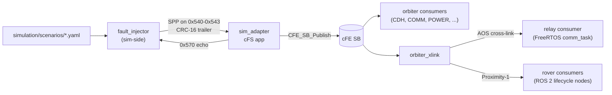

# 09 — Failure & Radiation

> Terminology: [../GLOSSARY.md](../GLOSSARY.md). Bibliography: [../standards/references.md](../standards/references.md). Coding conventions: [.claude/rules/cfs-apps.md](../../.claude/rules/cfs-apps.md), [.claude/rules/general.md](../../.claude/rules/general.md), [.claude/rules/security.md](../../.claude/rules/security.md). System context: [00-system-of-systems.md](00-system-of-systems.md). Protocol stack: [07-comms-stack.md](07-comms-stack.md). Time: [08-timing-and-clocks.md](08-timing-and-clocks.md). Scaling: [10-scaling-and-config.md](10-scaling-and-config.md). Sim ↔ FSW: [../interfaces/ICD-sim-fsw.md](../interfaces/ICD-sim-fsw.md). Packet bodies: [../interfaces/packet-catalog.md](../interfaces/packet-catalog.md). Decisions: [../standards/decisions-log.md](../standards/decisions-log.md). Verification: [../mission/verification/V&V-Plan.md](../mission/verification/V&V-Plan.md).

This doc is the **definition site for [Q-F3](../standards/decisions-log.md)** (EDAC / memory-protection hooks) and the cross-cutting authority on **failure injection and radiation-affected behavior** across SAKURA-II. Every segment doc that reserves a `.critical_mem` anchor, a `Vault<T>` wrapper, or a safing-path fault consumer cites this doc; every V&V scenario that exercises a fault injects it via the path described here.

Scope: **functional fault injection today**, **reserved hooks for SEU / EDAC / TMR** (Phase-B-plus), and the **radiation-environment posture** that motivates both. Per [ConOps §6](../mission/conops/ConOps.md), Phase A/B is functional injection only — bit-flip stimuli and EDAC scrubbing land as scale-up seams, not current code paths.

## 1. Terminology

- **Functional fault**: a scenario-driven perturbation of observable behavior at an in-software boundary (packet drop, clock skew, forced safe-mode, sensor-noise). No underlying hardware state is disturbed.
- **SEU (Single-Event Upset)**: a bit flip in volatile state caused by a charged particle; Phase-B-plus stimulus, not currently injected.
- **EDAC (Error Detection And Correction)**: a memory-layer mechanism (SECDED / Reed-Solomon / scrubbers) that detects and repairs bit-flipped state. SAKURA-II reserves a `.critical_mem` section and a `Vault<T>` wrapper as the future EDAC attachment surface.
- **TMR (Triple Modular Redundancy)**: three-voter pattern for high-criticality values (e.g. mode, time). SAKURA-II architects the voter seam but does not implement voting in Phase B.
- **Safing-path**: the local code path that transitions an asset to its class-specific safe state. Every segment defines one; see §4.
- **Vault**: the Rust analogue of `.critical_mem` — a wrapper type that is the *only* sanctioned way to store radiation-sensitive state in the ground / relay Rust crates.

## 2. Fault-Injection Model (today)

Two authoritative decisions set this doc's starting ground:

- Per [Q-F1](../standards/decisions-log.md), fault injection rides the **cFE Software Bus** on-target — definition site [07 §8](07-comms-stack.md).
- Per [Q-F2](../standards/decisions-log.md), the **minimum fault set** is four APIDs — definition site [07 §8](07-comms-stack.md).

This doc does **not** restate Q-F1 / Q-F2. It describes the end-to-end pipeline from scenario YAML to asset safing and adds the Q-F3 anchor on top.

### 2.1 APID reservation

The APID block is pinned upstream and the bodies live in the packet catalog:

| APID | Fault type | Body |
|---|---|---|
| `0x540` | Packet drop | [packet-catalog §7.1](../interfaces/packet-catalog.md) |
| `0x541` | Clock skew | [packet-catalog §7.2](../interfaces/packet-catalog.md) |
| `0x542` | Force safe-mode | [packet-catalog §7.3](../interfaces/packet-catalog.md) |
| `0x543` | Sensor-noise corruption | [packet-catalog §7.4](../interfaces/packet-catalog.md) |

Expansion is reserved on `0x544`–`0x56F` per [ICD-sim-fsw.md §3.5](../interfaces/ICD-sim-fsw.md). Adding a fault type is a catalog-first change; no fault code lives outside this pipeline.

### 2.2 End-to-end flow



The pipeline is **single-directional from sim to FSW**, with a `0x570` echo for sim-side book-keeping per [ICD-sim-fsw.md §7](../interfaces/ICD-sim-fsw.md). No fault consumer may re-emit a `0x540`–`0x543` packet on any external boundary — the egress filter enforcement is [01 §11](01-orbiter-cfs.md) (orbiter `TO`) and [06 §8.2](06-ground-segment-rust.md) (ground `ApidRouter`).

## 3. Sim-Side Producer

`fault_injector` is the sole legal source of fault packets. Per [05 §4](05-simulation-gazebo.md):

- **Input**: scenario YAML under `simulation/scenarios/*.yaml`, walked against simulated TAI sourced from `clock_link_model`.
- **Output**: SPPs on `0x540`–`0x543` with a trailing CRC-16/CCITT-FALSE per [ICD-sim-fsw.md §1](../interfaces/ICD-sim-fsw.md).
- **Transport**: shared memory (preferred) or UDS (fallback) — `sim_adapter` config choice, not pinned here.
- **Flight-build guard**: the entire `0x500`–`0x57F` APID block is compile-time unreachable under `CFS_FLIGHT_BUILD` per [ICD-sim-fsw.md §5](../interfaces/ICD-sim-fsw.md). This is the first defence; the egress filter in [01 §11](01-orbiter-cfs.md) is the second.

Scenario authoring is a **V&V-plan-level** discipline — see [V&V-Plan.md §4](../mission/verification/V&V-Plan.md) for how scenarios bind to SCN-NOM-01 / SCN-OFF-01 from ConOps.

## 4. FSW-Side Consumers

One consumer per fault type, per segment. Every consumer's safing behavior is defined in its segment doc; this table is the index:

| Fault | Orbiter (cFS) | Relay (FreeRTOS) | MCU (FreeRTOS) | Rover (ROS 2) |
|---|---|---|---|---|
| `0x540` packet drop | `orbiter_comm` per-link Bernoulli drop ([01 §11](01-orbiter-cfs.md)) | `comm_task` per-link drop ([02 §5](02-smallsat-relay.md)) | gateway `bus_rx` drop counter ([03 §8](03-subsystem-mcus.md)) | `rover_comm` link-drop sim hook ([04 §6](04-rovers-spaceros.md)) |
| `0x541` clock skew | `CFE_TIME` **read-hook** (§5.3) | `time_task` **read-hook** ([08 §5.2](08-timing-and-clocks.md)) | `clock_slave` (time-slave, skew upstream) ([03 §5](03-subsystem-mcus.md)) | ROS 2 time-bridge ([04 §7](04-rovers-spaceros.md)) |
| `0x542` force safe-mode | `orbiter_cdh` mode manager ([01 §11](01-orbiter-cfs.md)) | `mode_manager` task ([02 §5](02-smallsat-relay.md)) | `health` task + role-specific safe state ([03 §8](03-subsystem-mcus.md)) | rover lifecycle transition to `deactivate` ([04 §8](04-rovers-spaceros.md)) |
| `0x543` sensor-noise | per-HK app: noise overlay at sensor-primitive read ([01 §7.3](01-orbiter-cfs.md)) | — (relay has no sensors) | `app_logic` per-role overlay ([03 §4](03-subsystem-mcus.md)) | `rover_sensors_plugin` noise hook ([05 §3](05-simulation-gazebo.md)) |

Two load-bearing rules apply uniformly across consumers:

1. **Consumers never write to radiation-sensitive state.** Clock skew (`0x541`) must target the `.critical_mem`-resident time-store via the **read-hook** MID, never by overwriting the store directly — enforced at [ICD-sim-fsw.md §3.2](../interfaces/ICD-sim-fsw.md).
2. **Consumers log via `CFE_EVS_SendEvent` / `RCLCPP_INFO` / `log::info!`** — `printf` / `std::cout` stay banned even on the fault-consume path ([.claude/rules/general.md](../../.claude/rules/general.md)).

## 5. Reserved Hooks for SEU / EDAC — Q-F3 Anchor

Per [Q-F3](../standards/decisions-log.md):

> C-side anchor = `__attribute__((section(".critical_mem")))`. Rust-side anchor = dedicated `Vault<T>` wrapper. EDAC is primarily an FSW C concern; `Vault<T>` provides a parallel abstraction on the ground/relay Rust side for future cross-validation.

This section is the full treatment. It pins **what** the anchors are and **where** they apply, so segment docs can cite a single source.

### 5.1 C-side: `.critical_mem` section attribute

Every static or file-scope variable that holds radiation-sensitive state under `apps/**` declares the attribute. Canonical form:

```c
/* MISRA C:2012 Rule 8.11 deviation: .critical_mem section placement is
 * required by the radiation-memory strategy per
 * docs/architecture/09-failure-and-radiation.md §5. */
static uint64_t g_tai_ns __attribute__((section(".critical_mem")));
```

Placement rules:

| What | Goes in `.critical_mem` | Lives elsewhere |
|---|---|---|
| cFE `CFE_TIME` internal state | yes | — |
| Orbiter mode (nominal / safe / …) | yes | — |
| `health` task fault counters | yes | — |
| Per-app HK scratch buffers | no | `.bss` / `.data` |
| Command-dispatch local variables | no | stack |
| CFDP transaction state (ground/relay; Rust side) | see §5.2 `Vault<T>` | — |

The section is linker-placed; the linker script addition is a Phase-B-plus artifact, tracked as an Open item in §9. For Phase B the attribute is authored now so callers never have to be retrofitted.

Attribute is scoped to `apps/**`. It does not apply to `simulation/` (host-side) or `rust/` (see §5.2).

### 5.2 Rust-side: `Vault<T>` wrapper

On the Rust side, `Vault<T>` is a zero-overhead wrapper crate that is the **only** sanctioned home for radiation-sensitive state in `rust/ground_station/` and (future) `rust/cfs_bindings/` scrubbing paths. Per [06-ground-segment-rust.md](06-ground-segment-rust.md), the crate lands at `rust/vault/` (planned) with this shape:

```rust
/// Wrapper for radiation-sensitive state. In Phase B this is a newtype pass-through;
/// Phase-B-plus will add EDAC scrubbing + SECDED decode at the read boundary.
pub struct Vault<T: Copy + Eq> {
    inner: T,
    // Phase-B-plus: parity: u8, scrub_epoch: u32, ...
}

impl<T: Copy + Eq> Vault<T> {
    pub const fn new(v: T) -> Self { Self { inner: v } }
    pub fn read(&self) -> T { self.inner }
    pub fn write(&mut self, v: T) { self.inner = v; }
}

// SAFETY: read/write go through the type's own methods; direct field access is crate-private.
// The unsafe seam for future SECDED decode lives in a sibling module, gated behind a feature.
```

No `unsafe` is needed in Phase B — the Phase-B-plus SECDED path will add an `unsafe` block with a `// SAFETY:` comment per [.claude/rules/security.md](../../.claude/rules/security.md).

What goes in a `Vault<T>`:

- CFDP transaction-id counters that must survive a ground-station fault-restart (per [06-ground-segment-rust.md](06-ground-segment-rust.md)).
- `ApidRouter` filter table on the ground side — a bit flip here would let a sim-block APID escape on RF.
- Relay-side FreeRTOS `tai_ns` mirror (a future Rust re-implementation seam).

What does NOT go in a `Vault<T>`:

- Transient TM pipeline state.
- Log buffers.
- Display-layer UI state.

### 5.3 Clock-skew read-hook rule

Both sides share one invariant that the fault-injection path must honour:

> **Clock-skew injection (`0x541`) applies at the read-path wrapper, never by overwriting the `.critical_mem`-resident store.**

On the C side this means:

- `g_tai_ns` is `.critical_mem`-placed.
- All callers read it via `cfe_time_now()` which composes `g_tai_ns` + a skew offset.
- `sim_adapter` routes `0x541` packets to a **read-hook MID** (e.g. `0x188F`) consumed inside `cfe_time_now()`, not to the MID that owns `g_tai_ns`.

On the Rust side the same rule applies: skew is an overlay at `Vault<T>::read()`, never a `write()` to the underlying `tai_ns` mirror. Enforcement is reviewed during `/code-review` (see [.claude/skills/](../../.claude/skills/)).

### 5.4 Propagation manifest (from this definition site)

Other docs carry single-line forward-refs to this section. When Q-F3's answer changes, each must be re-synced:

- [08 §8](08-timing-and-clocks.md) — `.critical_mem` / `Vault<T>` forward-ref (reserved seams paragraph).
- [01 §6](01-orbiter-cfs.md) — `.critical_mem` anchor for orbiter FSW.
- [03 §8](03-subsystem-mcus.md) — MCU EDAC deferred note.
- [00 §2](00-system-of-systems.md) — `clock_link_model` container's failure-side cross-ref.
- [ICD-sim-fsw.md §3.2](../interfaces/ICD-sim-fsw.md) — clock-skew read-hook rule.
- [ConOps §6](../mission/conops/ConOps.md) — functional-injection-only posture.
- [.claude/rules/cfs-apps.md](../../.claude/rules/cfs-apps.md), [.claude/rules/general.md](../../.claude/rules/general.md) — MISRA deviation template for the attribute.

## 6. Scale-Up Seams (Phase-B-plus)

Reserved but not implemented. Each seam is named so it is visible as a deliberate non-goal rather than an accidental gap.

| Seam | Anchor | What activation requires |
|---|---|---|
| **SECDED on `.critical_mem`** | Linker script places `.critical_mem` in EDAC-backed RAM | Linker-script edit; hardware target with EDAC-RAM |
| **SECDED on `Vault<T>`** | `Vault<T>`'s `read()` gains parity decode | Feature flag `vault-secded`; new `unsafe` block in the decode path |
| **TMR voting** | `cFE_TIME`'s `Copy()` wrapper is the voter call site ([08 §8](08-timing-and-clocks.md)) | Triple store on `.critical_mem`; majority logic at read |
| **Bit-flip stimulus** | New APID in `0x544`–`0x56F`; packet body in [packet-catalog §7](../interfaces/packet-catalog.md) | Catalog row + `fault_injector` scenario keyword + consumer in `sim_adapter` |
| **Scrubber task** | cFE app `orbiter_scrubber` or FreeRTOS task `scrubber_task` | New app/task; period-table entry; HK packet |

Each seam is pinned to an existing structural choice — activation is a local change, not a repo-wide refactor. This is the whole point of anchoring the attribute and wrapper now.

## 7. Radiation-Environment Posture

SAKURA-II does not model RF-layer single-event effects — the simulator is above the link physics layer per [00 §1](00-system-of-systems.md). What the architecture **does** preserve:

| Asset | Environment (indicative, MVC) | Design implication |
|---|---|---|
| Orbiter-01 | Mars orbital, solar-proton event exposure | `.critical_mem` + TMR seam on `CFE_TIME` + scrubber anchor |
| Relay-01 | Same as orbiter (co-orbital) | Same; simpler app surface, fewer Vaulted values |
| Rover surface | Mars surface; regolith shielding | Scrubbing cadence can relax; `.critical_mem` still applied to mode-state |
| Cryobot | Subsurface; thermal-constrained | Power-bound scrubbing; `Vault<T>` / `.critical_mem` **state minimised** to reduce refresh cost |

Referenced bibliography (per [standards/references.md](../standards/references.md)):

- **cFE PSP Developers Guide** — for the `.critical_mem` linker-script integration approach on the HPSC target.
- **NASA-STD-8739.8B** — software assurance linkage for the EDAC claim in V&V.
- **NASA-STD-7009A** — models-and-simulations assurance for the fault-injection pipeline.

Europa-class cryobot radiation modelling (Jovian environment, shielded via ice) is out of scope for Phase B — the architecture preserves the `Vault<T>` / `.critical_mem` attachment so it can be added without a module refactor.

## 8. Verification Hooks

Each fault type has a bound V&V test class, detailed in [V&V-Plan.md §4](../mission/verification/V&V-Plan.md):

| Fault | Test class | Gate scenario |
|---|---|---|
| `0x540` packet drop | Integration | SCN-OFF-01 (cryobot tether BW-collapse) |
| `0x541` clock skew | Integration + unit | SCN-NOM-01 `time_suspect` latch |
| `0x542` force safe-mode | Integration + system | SCN-OFF-01 RESUME path |
| `0x543` sensor-noise | Unit + integration | Per-app HK residual check |
| SEU / bit-flip (Phase-B-plus) | Reserved; stimulus not yet built | Phase-B-plus placeholder |
| EDAC scrub event | Reserved | Phase-B-plus placeholder |

The `0x570` sim-side echo ([ICD-sim-fsw.md §7](../interfaces/ICD-sim-fsw.md)) is the closed-loop check — scenarios fail if sim-side emits diverge from `sim_adapter`'s routed count.

## 9. Open Items (tracked, not blocking)

- **Linker script for `.critical_mem`.** The attribute is authored now; the corresponding `SECTIONS { .critical_mem : ... }` block lands with the HPSC cross-build target ([Q-H8](../standards/decisions-log.md)). SITL builds place the section into ordinary RAM with no functional effect.
- **`rust/vault/` crate creation.** The trait/shape is defined here; the crate lives behind a Phase-B-plus PR that adds it to the workspace `Cargo.toml`.
- **SECDED parity width.** Deferred; choice (SECDED vs Reed-Solomon) lands with the EDAC-backed-RAM target selection.
- **Scrubber cadence table.** Per-asset cadence (see §7) lands once the scrubber task is authored.
- **Europa radiation deltas.** Cryobot outer-moon environment model deferred.

## 10. Decisions Resolved / Referenced

Resolved at this definition site:

- **[Q-F3](../standards/decisions-log.md) EDAC / memory-protection hooks** — **resolved**: `.critical_mem` attribute on C side + `Vault<T>` wrapper on Rust side (§5). Forward-ref sites listed in §5.4 quote this answer.

Referenced (resolved elsewhere):

- [Q-F1](../standards/decisions-log.md) Fault-injection transport = cFE SB — definition site [07 §8](07-comms-stack.md).
- [Q-F2](../standards/decisions-log.md) Minimum fault set — definition site [07 §8](07-comms-stack.md).
- [Q-F4](../standards/decisions-log.md) Time-authority ladder + drift budget — definition site [08 §3–4](08-timing-and-clocks.md).
- [Q-F6](../standards/decisions-log.md) Fleet-sync precision 1 ms — definition site [08 §2](08-timing-and-clocks.md).
- [Q-H8](../standards/decisions-log.md) HPSC cross-build — open; gates linker-script integration per §9.

## 11. What this doc is NOT

- Not a coding rulebook. Attribute / wrapper **usage rules** live in [.claude/rules/cfs-apps.md](../../.claude/rules/cfs-apps.md) and [.claude/rules/general.md](../../.claude/rules/general.md); this doc is the architecture source those rules cite.
- Not an ICD. Fault-packet wire formats live in [packet-catalog §7](../interfaces/packet-catalog.md); routing/validation lives in [ICD-sim-fsw.md](../interfaces/ICD-sim-fsw.md).
- Not a hardware / radiation-effects analysis. SEU rate estimates, mission-dose calculations, and part-level radiation hardness data are out of scope.
- Not a V&V plan. Test classes / gate scenarios / coverage targets live in [V&V-Plan.md](../mission/verification/V&V-Plan.md).
- Not a scheduler or mode-transition design. Safing-path *definitions* live in each segment's §8 / §11; this doc catalogues how fault packets *reach* those paths.
