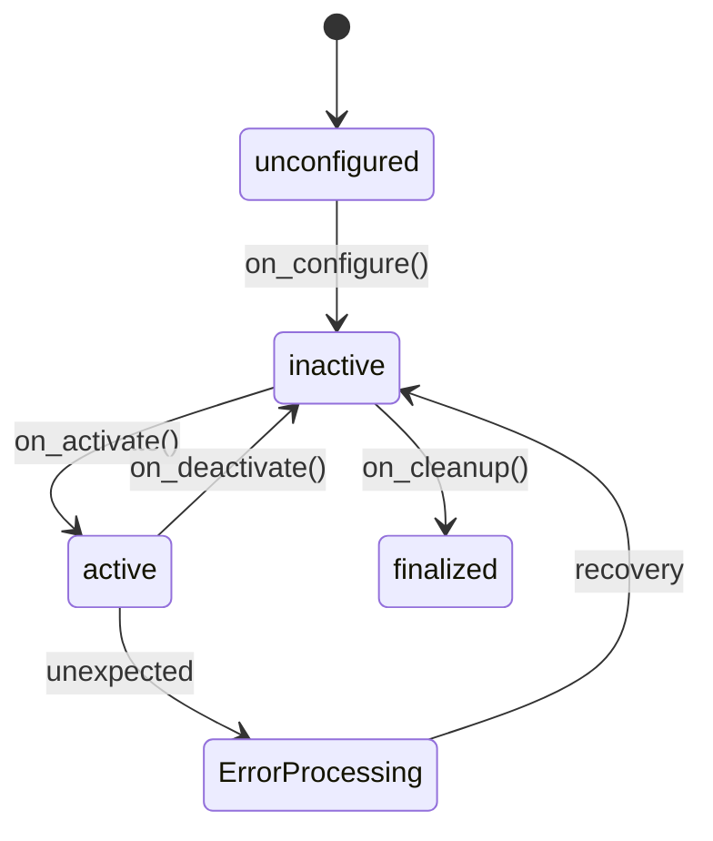
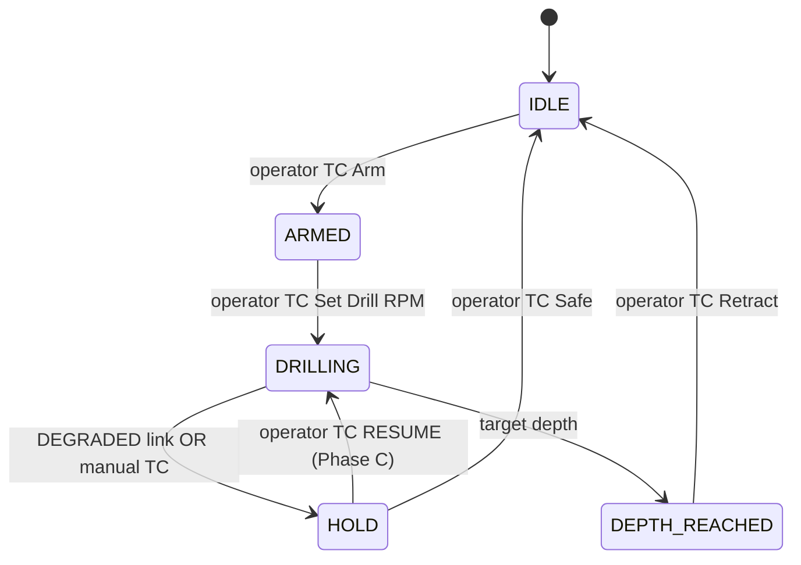

# Mission Phases — Per-Phase Detail

> Terminology: [../../GLOSSARY.md](../../GLOSSARY.md). Parent doc: [`ConOps.md`](ConOps.md). System context: [`../../architecture/00-system-of-systems.md`](../../architecture/00-system-of-systems.md). Time model: [`../../architecture/08-timing-and-clocks.md`](../../architecture/08-timing-and-clocks.md). Failure model: [`../../architecture/09-failure-and-radiation.md`](../../architecture/09-failure-and-radiation.md). Scaling / compose: [`../../architecture/10-scaling-and-config.md`](../../architecture/10-scaling-and-config.md). V&V: [`../verification/V&V-Plan.md`](../verification/V&V-Plan.md).

Parent doc [`ConOps.md §3`](ConOps.md) enumerates six phase boundaries (P1 MOI through P6 Safe Mode) with entry / exit criteria. This doc **expands** those phases with per-phase timelines, HK cadence expectations, per-asset state machines, off-nominal transitions, compose-profile selection, and V&V hooks. It does **not** redefine phase boundaries — [`ConOps.md §3`](ConOps.md) remains authoritative for the set and for entry / exit criteria.

## 1. Scope

This doc is the anchor for:

- Phase-scoped requirements (Phase C populates; IDs reserved).
- V&V scenario scoping — which scenarios run in which phase.
- Compose-profile selection per phase.
- Per-asset nominal state machines.

It is **not**:

- A timeline for a specific mission date (no calendar dates past the indicative T₀).
- A spacecraft operations plan (that tier is Phase C).
- A per-instance walkthrough.

## 2. Phase Overview (from ConOps)

Per [`ConOps.md §3`](ConOps.md):

| # | Phase | Entry criterion | Exit criterion | Active actors |
|---|---|---|---|---|
| P1 | MOI | Sim clock reaches MOI burn window | Orbiter-01 in stable Mars orbit | Orbiter, Ground |
| P2 | Relay Deployment | Orbiter-01 stable; Relay-01 separation command | Relay-01 acquires cross-link with Orbiter-01 | Orbiter, Relay, Ground |
| P3 | Surface EDL | Surface asset separation | Surface asset on ground, nominal telemetry via Relay | Orbiter, Relay, surface-asset-under-test, Ground |
| P4 | Surface Ops (nominal) | All MVC assets nominal | Mission-elapsed-time goal met OR off-nominal trigger | All |
| P5 | Cryobot Descent | Operator TC authorizes drill start | Cryobot reaches target depth OR tether fault | Cryobot, Relay, Orbiter, Ground |
| P6 | Safe Mode | Any asset enters safe | Operator commands exit; all assets nominal | Asset-in-safe + Ground |

Phase transitions are explicit events (cFE EVS on cFS assets, `rclcpp` logging on rovers) per [`ConOps.md §3`](ConOps.md).

## 3. Per-Phase Detail

### 3.1 P1 — Mars Orbit Insertion (MOI)

**Timeline**: ~1 hour of simulated T₀-relative time. The burn window is defined by the scenario T₀ in [`10 §3`](../../architecture/10-scaling-and-config.md) `mission.yaml`.

**HK cadence**:

| Source | APID | Rate | Notes |
|---|---|---|---|
| Orbiter-01 HK (sample_app) | `0x100` | 1 Hz | Always-on baseline |
| Orbiter-01 ADCS | `0x110` | **10 Hz** | Elevated during burn ([packet-catalog §8](../../interfaces/packet-catalog.md)) |
| Orbiter-01 Power | `0x130` | 1 Hz | |

**Active assets**: Orbiter + Ground only. Relay, MCUs, and surface assets are inactive (pre-deployment).

**State machine** (orbiter): `PRE_MOI → MOI_BURN → POST_MOI_STABILISING → ORBIT_STABLE`.

**V&V hook**: no fault injection nominally; Q-F3 read-hook regression ([`09 §5.3`](../../architecture/09-failure-and-radiation.md)) runs in background if the scenario declares it.

**Compose profile**: any — P1 is single-orbiter.

### 3.2 P2 — Relay Deployment

**Timeline**: ~30 min simulated.

**HK cadence**: unchanged from P1 + Relay-01 HK on APID `0x200` at 1 Hz once powered.

**Active assets**: Orbiter-01, Relay-01, Ground.

**State machine** (relay): `POWERED_OFF → BOOTING → ACQUIRING_XLINK → XLINK_ACTIVE`. Acquisition uses the Proximity-1-adjacent cross-link hailing cadence per [Q-C5](../../standards/decisions-log.md) — definition site in [`ICD-orbiter-relay.md §3`](../../interfaces/ICD-orbiter-relay.md).

**V&V hook**: cross-link establishment latency is a gate scenario asset (part of P2→P3 transition test).

**Compose profile**: any that includes a relay; all three do ([`10 §2`](../../architecture/10-scaling-and-config.md)).

### 3.3 P3 — Surface EDL

**Timeline**: ~15 min simulated per surface asset (EDL is fast).

**HK cadence**: baseline P2 + per-asset EDL telemetry at elevated rate during entry/descent phase.

**Active assets**: Orbiter-01, Relay-01, surface asset under test (`rover_land-01`, `rover_uav-01`, or `rover_cryobot-01` in turn), Ground.

**Per-asset state machine** (rover lifecycle nodes, all classes):

The EDL sequence transitions the asset from `unconfigured` (pre-separation) through `active` (nominal operation on the surface) — per ROS 2 lifecycle conventions ([`.claude/rules/ros2-nodes.md`](../../../.claude/rules/ros2-nodes.md) and [`04 §3`](../../architecture/04-rovers-spaceros.md)).

**V&V hook**: landing-success criteria from the ConOps (asset arrives with nominal HK via relay). Failed EDL transitions the rover directly to P6 (safe mode).

**Compose profile**: `full` covers all three surface classes; `minimal` covers rover_land + rover_uav (no cryobot); `scale-5` covers all.

### 3.4 P4 — Surface Ops (nominal)

**Timeline**: the bulk of the scenario — hours to days of simulated time, minutes to tens of minutes wall-clock.

**HK cadence**: steady-state per [packet-catalog §8](../../interfaces/packet-catalog.md). ~6.9 kbps total steady-state HK per [packet-catalog §9](../../interfaces/packet-catalog.md); well below 1 Mbps downlink.

**Active assets**: all.

**Per-asset state machine** (surface rovers): `active` with internal mode sub-states specific to class (e.g. `rover_land` mode: `HOLD → DRIVING → IMAGING`). Mode transitions via TC uplink per [`ConOps.md §4`](ConOps.md) step 6.

**V&V hook**: **SCN-NOM-01** is this phase's primary gate scenario per [`V&V-Plan §3.1`](../verification/V&V-Plan.md). Run the full HK-downlink → TC-ack round trip; assert no SPP gaps.

**Compose profile**: any. `minimal` is sufficient for SCN-NOM-01; `full` adds the cryobot; `scale-5` stresses scaling ([`10 §2`](../../architecture/10-scaling-and-config.md)).

### 3.5 P5 — Cryobot Descent

**Timeline**: hours of simulated time during drilling.

**HK cadence**: P4 + cryobot HK on APID `0x400` at 1 Hz (nominal) or `0x400` reduced at 1 Hz (BW-collapse) per [packet-catalog §8](../../interfaces/packet-catalog.md).

**Active assets**: all, with rover_land-01 in tether-relay role for the cryobot per [`04 §4`](../../architecture/04-rovers-spaceros.md).

**Per-asset state machine** (cryobot drill controller):

The `HOLD` transition from `DRILLING` fires on tether DEGRADED — see [3.6](#36-p6--safe-mode) and the SCN-OFF-01 scenario.

**V&V hook**: **SCN-OFF-01** ([`V&V-Plan §3.2`](../verification/V&V-Plan.md)) exercises the DRILLING→HOLD transition via `0x540` packet-drop fault injection. The independent-watchdog fate-share assertion ([`ConOps.md §5`](ConOps.md)) is tested here.

**Compose profile**: `full` or `scale-5` (cryobot required). `minimal` omits cryobot, so P5 scenarios don't apply.

### 3.6 P6 — Safe Mode

**Timeline**: indefinite — P6 lasts until operator commands RESUME (and RESUME itself is deferred to Phase C per [`ConOps.md §5`](ConOps.md)).

**HK cadence**: baseline 1 Hz on the affected asset; elevated event-log emission until the trigger is cleared.

**Active assets**: asset-in-safe + Ground. Other assets continue nominal unless the fault cascades.

**Safe-mode ladder** (per [`ConOps.md §7`](ConOps.md)):

1. **Detection** (local): asset-internal invariant violation, watchdog timeout, or operator TC `0x542` force-safe.
2. **Localization**: asset enters its class-specific safe mode.
3. **Propagation**: event logged upstream (MCU → cFS → AOS; rover → relay → orbiter → ground).
4. **Human-in-the-loop**: no autonomous exit from safe mode in Phase A/B. Operator must acknowledge.

**Per-asset safe states** (summary; detail in each segment's §11):

| Asset | Safe state |
|---|---|
| Orbiter ([`01 §11`](../../architecture/01-orbiter-cfs.md)) | Autonomous-SCLK time, HK continues, no actuation |
| Relay ([`02 §5`](../../architecture/02-smallsat-relay.md)) | Store-and-forward holds, HK continues |
| MCU ([`03 §8`](../../architecture/03-subsystem-mcus.md)) | Role-specific: RWA → zero torque, EPS → hold switches, payload → sensors off |
| Rover_land | Lifecycle `inactive`; no mobility commands honored |
| Rover_uav | Lifecycle `inactive`; motors stopped |
| Rover_cryobot | Drill `HOLD`; tether standby |

**V&V hook**: safe-mode entry latency is asserted in [`V&V-Plan §3.2 TC-SCN-OFF-01-C`](../verification/V&V-Plan.md). Phase C will add RESUME path tests.

**Compose profile**: whichever was active when P6 triggered. P6 does not change compose topology.

## 4. Off-Nominal Transitions

Beyond nominal `P_n → P_{n+1}`, the following off-nominal transitions are in scope:

| Trigger | From | To | Responder |
|---|---|---|---|
| Watchdog miss on any asset | any | P6 | local `HS` or `health` task |
| Operator TC `0x542` force-safe | any | P6 | target asset's mode manager |
| EDL failure | P3 | P6 | failed surface asset |
| Tether BW-collapse trigger | P5 | P6 (cryobot only) | cryobot comm node |
| Cross-link LOS > threshold | P2–P5 | degraded (not safe-mode) | relay buffers; orbiter emits `CROSS_LINK_LOS` event |
| Ground LOS > threshold | P1–P5 | degraded | orbiter switches to `TIME_CFG_SRC_MET` per [`08 §5.1`](../../architecture/08-timing-and-clocks.md); `time_suspect` flag eventually |
| `.critical_mem` integrity fault (Phase-B-plus) | any | P6 | scrubber task ([`09 §6`](../../architecture/09-failure-and-radiation.md)) |

Each off-nominal transition has a corresponding V&V scenario or is reserved for Phase-B-plus per [`09 §6`](../../architecture/09-failure-and-radiation.md).

## 5. Compose-Profile Selection per Phase

Summarising cross-refs:

| Phase | Works on `minimal` | Works on `full` | Works on `scale-5` |
|---|---|---|---|
| P1 MOI | yes | yes | yes |
| P2 Relay Deployment | yes | yes | yes |
| P3 Surface EDL | partial (no cryobot) | yes | yes |
| P4 Surface Ops | yes (no cryobot) | yes | yes |
| P5 Cryobot Descent | **no** (cryobot omitted) | yes | yes |
| P6 Safe Mode | yes | yes | yes |

P5 requires `full` or `scale-5` since `minimal` has no cryobot per [`10 §2`](../../architecture/10-scaling-and-config.md).

## 6. Time Behavior per Phase

Per [`08`](../../architecture/08-timing-and-clocks.md), all phases use the hybrid time-authority ladder. Notes on phase-specific concerns:

- **P1**: ground is primary; orbiter seeds SCLK from first ground TCP.
- **P2–P5 (AOS)**: ladder is closed; drift correction-tracked.
- **Any phase (LOS)**: orbiter transitions to autonomous SCLK; **50 ms / 4 h** drift budget per [Q-F4](../../standards/decisions-log.md).
- **P6**: time service integrity is a safing concern — `time_suspect` flag should propagate to TM if the LOS exceeds the drift budget.

Mission T₀ (indicative date `2026-07-15T00:00:00Z`) lives in [`10 §3`](../../architecture/10-scaling-and-config.md) `mission.yaml`. Open item: a concrete scenario-date per-phase breakdown would aid scenario authoring, tracked in [`ConOps §8`](ConOps.md).

## 7. Requirement Traceability

Phase C populates `mission/requirements/` with `SYS-REQ-####`, `FSW-REQ-####`, `ROV-REQ-####`, `GND-REQ-####`. Each requirement will carry a `phase:` field indicating which of P1–P6 it applies to.

Until then, this doc reserves the structure. The linter (planned per [`V&V-Plan §10`](../verification/V&V-Plan.md)) will assert every `phase: Pn` value resolves to a phase enumerated in [`ConOps.md §3`](ConOps.md).

## 8. Open Items

- **Fleet-scaling CoO for Scale-5** with >1 orbiter above the horizon at a surface asset (relay selection policy). Tracked in [`ConOps §8`](ConOps.md); expansion here once decided.
- **Concrete scenario-date per-phase breakdown** — indicative T₀ exists; per-phase date math aids authoring.
- **RESUME TCs** for P6 — Phase C.
- **Dynamic time-authority election** when Scale-5 has multiple orbiters — Phase B+ per [`10 §7`](../../architecture/10-scaling-and-config.md).
- **Mission-lifetime phase** (end-of-mission safing, deorbit) — out of scope for Phase B.

## 9. What this doc is NOT

- Not a phase-entry criterion authority — [`ConOps.md §3`](ConOps.md) owns that.
- Not an operations plan. Per-phase operator procedures are Phase C.
- Not a safety case. Phase-specific hazard analysis is Phase C.
- Not a requirements document. IDs and text live under `mission/requirements/` (Phase C).
