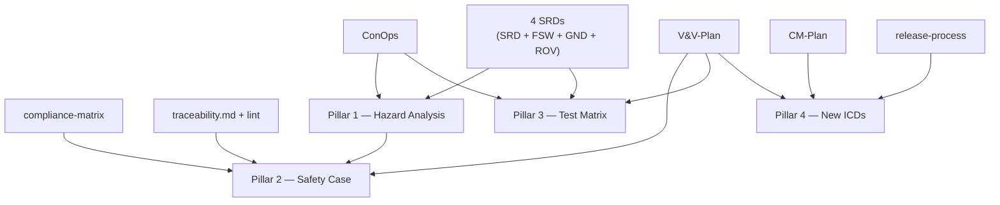

# SAKURA-II — Phase D Roadmap

> **Status: roadmap + implementation plan agreed — Phase D deliverables NOT yet authored.** Scope decided: prerequisites-first (Stage 1 clears the §6 entry triggers), then exhaustive / production-depth authoring of all four pillars (Stage 2). See §8 below for the two-stage breakdown. Individual deliverables still land in future PRs; this banner flips to `✅ landed` only when §6 is honestly green and §2 pillars each point to a real file.

> Terminology: [../GLOSSARY.md](../GLOSSARY.md). Bibliography: [../standards/references.md](../standards/references.md). V&V plan: [verification/V&V-Plan.md](verification/V&V-Plan.md). ConOps: [conops/ConOps.md](conops/ConOps.md). SRDs: [requirements/SRD.md](requirements/SRD.md), [FSW-SRD.md](requirements/FSW-SRD.md), [GND-SRD.md](requirements/GND-SRD.md), [ROVER-SRD.md](requirements/ROVER-SRD.md). Decisions: [../standards/decisions-log.md](../standards/decisions-log.md). Compliance matrix: [verification/compliance-matrix.md](verification/compliance-matrix.md). CM plan: [configuration/CM-Plan.md](configuration/CM-Plan.md).

Phase C closed with a PDR-surrogate posture: 114 requirements across four SRDs, traceability enforcement ([`scripts/traceability-lint.py`](../../scripts/traceability-lint.py) → [SYS-REQ-0080](requirements/SRD.md)), a compliance matrix, CM plan, and release process. Phase D is the next formal tier — it closes the assurance loop by **arguing that the system is safe**, not just correct.

This document is the signpost. It names the four Phase D pillars, sketches the dependency graph on Phase C artefacts, and fixes the entry triggers. Deliverable content — the actual hazard list, GSN argument, test matrix, new ICDs — is out of scope here and lands when Phase D opens.

## 1. Purpose

Give a future mission-assurance reviewer a single page they can read to know:

- What exists today (Phase C).
- What Phase D is about to add, organised into four pillars.
- Which Phase C artefacts each pillar rests on.
- What has to be true before Phase D work can start.
- What Phase D is explicitly *not* — to prevent scope creep into flight qualification or DO-178C conformance claims.

## 2. Four Pillars Beyond Phase C

### 2.1 Hazard Analysis (STPA-style)

System-Theoretic Process Analysis grounded in [ConOps §4–5](conops/ConOps.md) scenarios. For each scenario, enumerate:

- The unsafe control actions (UCAs) each controller could perform (orbiter, relay, each rover, ground station).
- The hazards each UCA could cause (loss of mission, loss of asset, loss of science, loss of operator trust).
- The safety constraints that prevent each UCA.
- The requirements that enforce each safety constraint (cite back to SRDs).

Deliverable: `docs/mission/safety/hazard-analysis.md` (single file; one table per ConOps scenario).

**Planned depth: exhaustive.** Target ≥ 80 UCA rows (5 controllers × 4 UCA types × 4 control actions per scenario, per Stage 2.A). Every SYS-REQ-#### with a clear safety role cited at least once in the requirement-binding index; cascade / cross-scenario analysis covers ≥ 4 two-constraint failure combinations.

Why STPA not FTA: STPA is top-down and control-structure-aware, which matches the fleet-of-controllers nature of SAKURA-II better than fault-tree decomposition. Aligns with [NASA-STD-8739.8B](../standards/references.md) software-safety discipline without the formal hazard-tracking database that DO-178C would require.

### 2.2 Safety Case (GSN notation)

A Goal Structuring Notation argument tree asserting "SAKURA-II as authored meets its safety goals for the SITL demonstrator tier." Each claim node (`G1`, `G2`, ...) has either:

- A **strategy** node (`S1`, ...) decomposing it, or
- A **solution** node (`Sn1`, ...) pointing to evidence — a test artefact, a compliance-matrix row, a code review, an SRD requirement.

Deliverable: `docs/mission/safety/safety-case.md` + `docs/mission/safety/diagrams/gsn-top-level.puml` (PlantUML GSN rendering).

Evidence nodes bind to:

- [`verification/compliance-matrix.md`](verification/compliance-matrix.md) rows — "is a claim X satisfied?"
- [`verification/V&V-Plan.md §3`](verification/V&V-Plan.md) scenario-test artefacts — "has X been demonstrated?"
- [`requirements/traceability.md`](requirements/traceability.md) rows — "does X trace to a requirement?"

The top claim is deliberately scoped to "SITL demonstrator," not flight. Flight-tier claims require hardware qualification data that SAKURA-II does not produce.

**Planned depth: exhaustive.** Target ≥ 34 sub-goals (one per SYS-REQ-####) and ≥ 100 solution nodes (FSW / GND / ROV reqs reached via their SYS-REQ parent or directly). Per-segment GSN subtrees split out under `diagrams/` if the top-level tree exceeds readable inline depth. Coverage attestation table in the safety-case closes over all 34 SYS-REQ-####.

### 2.3 Concrete Per-Scenario Test Matrix

[`V&V-Plan.md §3`](verification/V&V-Plan.md) defines scenario *classes* and binds them to requirements. Phase D populates the instance-level matrix: for each ConOps scenario, a concrete table of test cases (`TC-SCN-NOM-01-A`, `-B`, `-C`, `-D` are already sketched for SCN-NOM-01; the Phase D pass expands the catalogue and fills in the `traces-to` column with real requirement IDs).

Deliverable: `docs/mission/verification/test-matrix.md` — one table per scenario, one row per test case, columns for `ID / Location / Asserts / Traces to / Phase-C-gate`.

Drives the YAML files under `simulation/scenarios/` (currently an open `V&V-Plan §10` item) — the matrix fixes what each YAML must exercise.

**Planned depth: exhaustive.** Target ≥ 150 test-case rows total, with ≥ 20 concrete cases each for SCN-NOM-01 and SCN-OFF-01 (expanding TC-SCN-NOM-01-A..D), a cross-cutting class section, a fault-injection matrix (0x540–0x543), and a coverage-closure table that shows every one of 114 requirement IDs cited in at least one `Traces-to` cell.

### 2.4 External-Interface ICDs Beyond the Current Seven

Today's interfaces suite covers the seven documented boundaries. Phase D adds three more:

- `ICD-ground-ops-console.md` — the UI boundary between `ground_station` and the human operator. Today's `ConOps` assumes a console exists but does not constrain its contract.
- `ICD-sim-scenario-authoring.md` — the scenario YAML schema that `simulation/scenarios/*.yaml` must satisfy. Today sketched in [`V&V-Plan.md §8`](verification/V&V-Plan.md); Phase D formalises it.
- `ICD-release-pipeline.md` — the release artefact contract: what the release workflow produces, what the CM baseline includes, how a consumer consumes a tagged build. Today implicit in [`release-process.md`](configuration/release-process.md); Phase D splits it out as a proper ICD.

Deliverables: three new files under `docs/interfaces/`.

**Planned depth: exhaustive.** Each of the three ICDs follows the existing seven-ICD section pattern (purpose & scope → participants & roles → physical/logical layer → message / data format → timing & sequencing → error handling → versioning → open items). `ICD-sim-scenario-authoring.md` supersedes the Stage 1 stub YAML schema and becomes the definitive contract that scenario YAMLs validate against.

## 3. Dependency Graph on Phase C

Reading the graph:

- **Hazard analysis** is the entry point. Safety case depends on it; test matrix does not (the matrix expands V&V-Plan §3 directly).
- **Safety case** is the most evidence-heavy pillar. Delay this one until compliance matrix and traceability are both stable through at least one release cycle.
- **Test matrix** can start in parallel with hazard analysis — different mental gear.
- **New ICDs** are the lightest pillar and can go whenever.

## 4. What Phase D is NOT

- **Not flight-hardware qualification.** Radiation, thermal, vibe, TVAC — out of scope. [`V&V-Plan.md §1.2`](verification/V&V-Plan.md) already draws this line; Phase D does not redraw it.
- **Not a DO-178C conformance claim.** SAKURA-II aligns with NASA-STD / ECSS families per [`references.md §3–4`](../standards/references.md); it does not produce the objective matrix DO-178C requires. If a consumer needs DO-178C evidence, they fork SAKURA-II and author the objective-level proofs themselves — the scaffolding here supports that but does not perform it.
- **Not a hazard-tracking database.** The hazard analysis is a document. There is no live database with ticket states, severity scoring, or CAP tracking. Any consumer who needs that uses Linear / Jira / ClearQuest / (etc.) — not a file in this repo.
- **Not a programme-level V&V plan.** [`V&V-Plan.md`](verification/V&V-Plan.md) remains the V&V reference; Phase D expands §3 with the test matrix and does not rewrite the plan's structure.

## 5. Estimated Deliverable Count

Informational. Actual counts determined at Phase D open.

| Pillar | Expected deliverables | Approx. count |
|---|---|---|
| Hazard analysis | New file under `mission/safety/` | 1 |
| Safety case | Markdown + GSN PlantUML source + rendered SVG | 2 + 1 diagram |
| Test matrix | New file under `mission/verification/` + scenario YAML stubs in `simulation/scenarios/` | 1 + *N* (per scenario) |
| New ICDs | Three new files under `interfaces/` | 3 |
| Registry / README updates | Update `README.md` + `GLOSSARY.md` + possibly `references.md` | — |

## 6. Entry Triggers for Starting Phase D

Phase D does not start until **all three** are true. **Status: none met; all three are owned by Stage 1 of the agreed implementation plan (see §8).**

1. **CI is green in production.** `.github/workflows/ci.yml` per [`../dev/ci-workflow.md`](../dev/ci-workflow.md) is implemented, merged, and has been the gate for at least one release cycle. Without working CI, the safety case's evidence nodes cannot point at a reliable mechanised check. *(Stage 1.A.)*
2. **Both planned linters are implemented.** `scripts/apid_mid_lint.py` per [`../dev/linter-specs/apid-mid-lint.md`](../dev/linter-specs/apid-mid-lint.md) and `scripts/citation_lint.py` per [`../dev/linter-specs/citation-lint.md`](../dev/linter-specs/citation-lint.md). These close two classes of "invariant not mechanised" that would otherwise weaken the safety argument. *(Stage 1.B.)*
3. **At least one end-to-end integration test has landed.** Today [`V&V-Plan.md §2.3`](verification/V&V-Plan.md) and `simulation/scenarios/` are design-only. Phase D cannot bind a safety-case evidence node to a test that does not exist. *(Stage 1.C and 1.D.)*

Triggers 1 and 2 are sequenceable — they are the Phase C-plus tightening agenda. Trigger 3 is the deepest — it likely gates Phase D by several months.

## 7. Out of Scope (this roadmap only)

- **No deliverable content.** Specifically: no hazard list, no GSN argument, no test-case rows, no new ICD content. This document names pillars; it does not populate them.
- **No new requirement IDs.** Phase D may discover requirements, but the SRDs and traceability linter are stable; new IDs land via normal [`CM-Plan.md`](configuration/CM-Plan.md) change control, not via this roadmap.
- **No tooling changes.** GSN rendering uses the existing PlantUML pipeline — no new renderer in `scripts/`.
- **No Phase E preview.** Phase E (if it exists) would be flight-hardware qualification — a programme-level transition this repo does not attempt to scaffold.

## 8. Implementation Plan (agreed)

The implementation plan has two stages, sequenced so the §6 entry triggers are honestly met before any Phase D content is authored. Target depth across §2 pillars is **exhaustive** (see per-pillar "Planned depth" notes).

### Stage 1 — Phase C-plus prerequisites (clears §6)

| Item | Artefact | Spec source |
|---|---|---|
| 1.A | `.github/workflows/ci.yml` with lint / build / test / scenario-smoke jobs per `V&V-Plan §7.2` and `SYS-REQ-0070..0074` | [`../dev/ci-workflow.md`](../dev/ci-workflow.md) |
| 1.B | `scripts/apid_mid_lint.py` + `scripts/citation_lint.py` (+ unit tests), modelled on existing `scripts/traceability-lint.py` | [`../dev/linter-specs/apid-mid-lint.md`](../dev/linter-specs/apid-mid-lint.md), [`../dev/linter-specs/citation-lint.md`](../dev/linter-specs/citation-lint.md), [`../dev/howto/authoring-a-repo-linter.md`](../dev/howto/authoring-a-repo-linter.md) |
| 1.C | `simulation/scenarios/scn-nom-01.yaml` + `scn-off-01.yaml` — stub schema; Stage 2.D.2 supersedes with the formal `ICD-sim-scenario-authoring.md` | [ConOps §4–5](conops/ConOps.md), [`V&V-Plan.md §8`](verification/V&V-Plan.md) |
| 1.D | End-to-end integration test exercising SCN-NOM-01 through the existing stack, asserting TC-SCN-NOM-01-A..D, wired into CI as the `scenario-smoke` job | [`../dev/simulation-walkthrough.md`](../dev/simulation-walkthrough.md), [`V&V-Plan.md §2.3 & §3`](verification/V&V-Plan.md) |

Stage 1 exit gate: all three §6 triggers honestly green. Also clears the "Design-spec complete, implementation deferred" block in [`../README.md`](../README.md).

### Stage 2 — Phase D pillars (authors §2 content)

Sequencing inside Stage 2 per the §3 dependency graph:

- **2.A Hazard Analysis first** (feeds 2.B).
- **2.C Test Matrix** can start in parallel with 2.A (independent mental gear).
- **2.D Three new ICDs** can start any time (lightest, independent).
- **2.B Safety Case last** (needs 2.A complete plus compliance-matrix stable through one release cycle after Stage 1.A lands CI).

Stage 2.E bundles the cross-cutting updates triggered by the pillar work:

- [`../README.md`](../README.md) — Tree, Next Steps, Phase C, Phase D, Verification sections.
- This file (§2 deliverable links flip to past tense; §5 counts replaced with actuals; §6 triggers prefixed `✅`; banner flips to `Phase D landed`).
- [`../GLOSSARY.md`](../GLOSSARY.md) — STPA / UCA / GSN / safety-analysis terminology.
- [`../standards/references.md`](../standards/references.md) — STPA handbook, GSN Community Standard v3, NASA-STD-8739.8B (confirm present).
- [`verification/compliance-matrix.md`](verification/compliance-matrix.md) — rows for NASA-STD-8739.8B §5, ECSS-Q-ST-80C Phase-D specifics, GSN Community Standard; evidence column cites safety-case solution node IDs.
- [`requirements/traceability.md`](requirements/traceability.md) — V&V artefact column pointed at new test-matrix rows where relevant.
- [`../REPO_MAP.md`](../REPO_MAP.md) — `docs/mission/safety/` listed.

### Out of scope for the implementation plan

Same as §4 + §7 of this roadmap: no flight-hardware qualification, no DO-178C conformance claim, no hazard-tracking database, no programme-level V&V rewrite, no Phase E preview, no new requirement IDs outside CM change control, no new diagram-rendering tooling.
